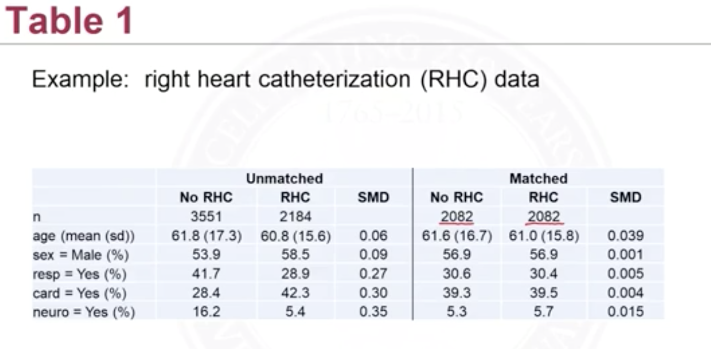
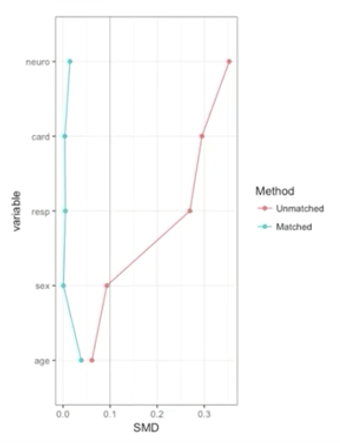

<u>Matching</u>: Match individuals in the treated group $$W_i=1$$ to individuals in the control group $$W_i=0$$ with similar or same values of covariates $$\mathbf X_i$$. This is on the basis that $$\mathbf X$$ is confounding. Let the outcome $$Y_i$$ be how good/bad of a disease. And $$W_i$$ is taking or not a medicine, $$X_i$$ (one covariate so it's not vector) is just age. By matching we want to find people with same age but with different values of $$W_i$$. This is good.

But note that there will be cases that there's *no* overlaps between these distributions. This is saying in this observational dataset, it's possible that, for example, very young (20-30) people never take the medicine, very old (60-80) people take the medicine. Then we have no way of measuring the causal effect of this medicine by matching. 

<figure>
  <figcaption style="text-align: center; font-family: MJXc-TeX-math-I,MJXc-TeX-math-Ix,MJXc-TeX-math-Iw; font-size: 1.1rem;">Figure 1. Exmaple of Matching</figcaption>
</figure>

Note when we are doing matching we are matching one part of the population to another part. For example, we often match control group's covariate to treated group because there're often *more* control group people than treated group people. Then in this case we are in fact trying to get the causal effect on the *treated* because we make the distributions of covariates look like that in the treated population.

<u>Fine balance</u>: unlike the balance we've talked about above, if we cannot find exact matches, then a match that can generate same distribution of covariates maybe enough. 

<figure>
  <figcaption style="text-align: center; font-family: MJXc-TeX-math-I,MJXc-TeX-math-Ix,MJXc-TeX-math-Iw; font-size: 1.1rem;">Figure 2. Exmaple of Fine Balance</figcaption>
</figure>

## Matching Directly on Confounders

Because we typically cannot match exactly, we need to choose some metrics of closeness. 

- Mahalanobis distance
- Robust Mahalanobis distance 

Let $$\mathbf X_i=[x_1,x_2,…,x_n]^\top$$. And the Mahalanobis distance between covariates $$\mathbf X_i$$ and $$\mathbf X_j$$ is 

$$
d(\mathbf X_i,\mathbf X_j)=\sqrt{\underbrace{(\mathbf X_i-\mathbf X_j)^\top}_{\mathbb R^{1\times n}} \underbrace{S^{-1}}_{\mathbb R^{n\times n}}\underbrace{(\mathbf X_i-\mathbf X_j)}_{\mathbb R^{n\times 1}}}
$$

let $$\mathbf Z=\mathbf X_i-\mathbf X_j$$ where $$S=Cov(\mathbf Z,\mathbf Z)$$  the covariance matrix. and $$S_{ij}=Cov(Z_i,Z_j)$$. Intuitively, this is a square root of the distance between each covariate scaled by the covariance matrix (it's like the distance between two scalar random variable scaled by the summed variance). 

The robust Mahalanobis distance is motivated to control the outliers Outliers can create a large unnecessary distance. A robust Mahalanobis just replaces the original covariate values with its rank. And the diagonal will be constant because rank typed values have same variance (scale)?

Other ways are if we have some very important variables we need it to have an exact match, then we can change its distance to infinity if they do not match in two data item. And we can match propensity scores as well. 

## Greedy nearest neighbor matching

Greedy matching is an algorithm for one-to-one matching. Assume we have more control subjects than treated subjects. 

Steps:

1. Randomly order the list of treated and control subjects
2. Start with the first treated subject, match it to the control with smallest distance (this is greedy)
3. Remove the matched control from the list of available matches
4. Move on to the next treated subject. Match to the control with the smallest distance
5. Repeated steps 3 and 4 until we match all treated subjects.

A caliper is maximum acceptable distance. We can get rid of the treated subject if the best match is greater than the caliper. If no matches within caliper, it may be a sign that positivity assumption would be violated. 

## Optimal Matching

Apparently greedy matching is not optimal. 1 million treatment-control pair (for e.g. 100 treated and 1,000 controls) are feasible but not fast. 

## Assessing Balance

Assessing balance means to assess whether the matching was successful. The standardized difference (not depending on sample size) is 
$$
smd=\frac{\overline X_{treatment}-\overline X_{control}}{\sqrt{(s^2_{treatment}-s^2_{control})/2}}
$$
The rule of thumb is (absolute value)

- Value <0.1 is good
- 0.1-0.2 is not too alarming
- />0.2 is problematic 

Generally, we compute the $smd$ for every covariate variable $X_j$ s.t. $X_1,…X_j,..\in\mathbf X$ (representing all covariates). 

<figure>
  <figcaption style="text-align: center; font-family: MJXc-TeX-math-I,MJXc-TeX-math-Ix,MJXc-TeX-math-Iw; font-size: 1.1rem;">Figure 3. SMD table example; No RHC is the control group and RHC is the treated group</figcaption>
</figure>

We can also plot the SMD for each covariates. This is especially useful when we have many covariates. 

<figure>
  <figcaption style="text-align: center; font-family: MJXc-TeX-math-I,MJXc-TeX-math-Ix,MJXc-TeX-math-Iw; font-size: 1.1rem;">Figure 4. SMD vs covariates plot</figcaption>
</figure>

## Analyze data after matching

Permutation test. 

## Sensitivity Analysis

<u>Overt bias</u> could occur if there was imbalance on observed covariates. But there is no guarantee that matching will result in balance on unobserved covariates. In this case ignorability/unconfoundedness assumption is violated. And we have <u>hidden bias</u>. The main idea about sensitivity analysis is to determine how severe it would have to be to <u>change conclusion</u>: 

- Change from statistically significant or not
- Change in direction of effect (like positive treatment effect to negative)

Let $\pi_j$ be the probability that person $j$ receives treatment and $\pi_k$ the probability person $k$ receives treatment. And let
$$
\Gamma=\frac{\pi_j/(1-\pi_j)}{\pi_k/(1-\pi_k)}
$$
be a odds ratio. Under unconfoundedness assumption, if we match all the covariates, and there're no unobserved ones, we shall have $\Gamma=1$ since $\pi_j=\pi_k$ the probability of any two persons $j$ and $k$ receive treatments shall be the same. To test the sensitivity, we can increase $\Gamma$ until evidence of treatment effect (like no longer statistical significant) goes away, if 

- this happens when $\Gamma=1.1$ then the test/inference is <u>very sensitive</u> to hidden bias
- this happens when $\Gamma=5.0$ then it's <u>not very sensitive</u> to hidden bias

It's beyond the scope on how to increase $\Gamma$, but there are r-packages that allow us to easily perform the analysis. 

