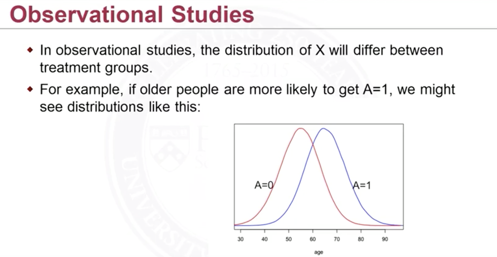
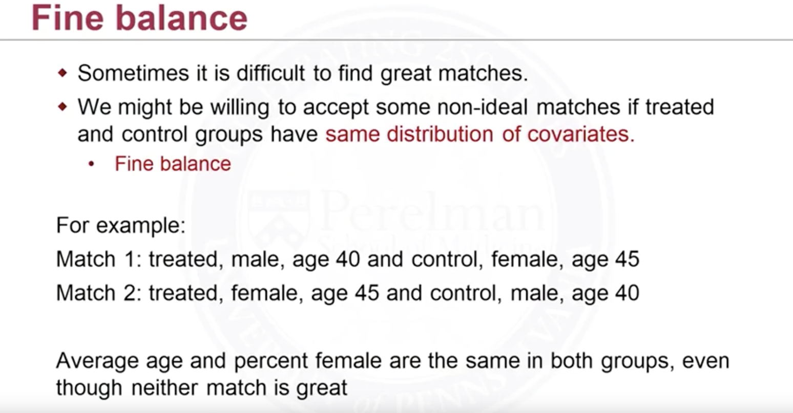

<u>Matching</u>: Match individuals in the treated group $$W_i=1$$ to individuals in the control group $$W_i=0$$ with similar or same values of covariates $$\mathbf Z$$. This is on the basis that $$\mathbf Z$$ is confounding. Take the outcome $$Y_i$$ as how good/bad of a disease. And $$W_i$$ is taking or not a medicine, $$Z_i$$ is age. By matching we want to find people with same age but with different values of $$W_i$$. This is good.

But note that there will be cases that there's *no* overlaps between these distributions. This is saying in this observational dataset, it's possible that, for example, very young (20-30) people never take the medicine, very old (60-80) people take the medicine. Then we have no way of measuring the causal effect of this medicine by matching. 

<figure>
  <figcaption style="text-align: center; font-family: MJXc-TeX-math-I,MJXc-TeX-math-Ix,MJXc-TeX-math-Iw; font-size: 1.1rem;">Figure 1. Exmaple of Matching</figcaption>
</figure>

Note when we are doing matching we are matching one part of the population to another part. For example, we often match control group's covariate to treated group because there're often *more* control group people than treated group people. Then in this case we are in fact trying to get the causal effect on the *treated* because we make the distributions of covariates look like that in the treated population.

<u>Fine balance</u>: unlike the balance we've talked about above, if we cannot find exact matches, then a match that can generate same distribution of covariates maybe enough. 

<figure>
  <figcaption style="text-align: center; font-family: MJXc-TeX-math-I,MJXc-TeX-math-Ix,MJXc-TeX-math-Iw; font-size: 1.1rem;">Figure 2. Exmaple of Fine Balance</figcaption>
</figure>

## Matching Directly on Confounders

Because we typically cannot match exactly, we need to choose some metrics of closeness. 

- Mahalanobis distance
- Robust mahalanobis distance 

