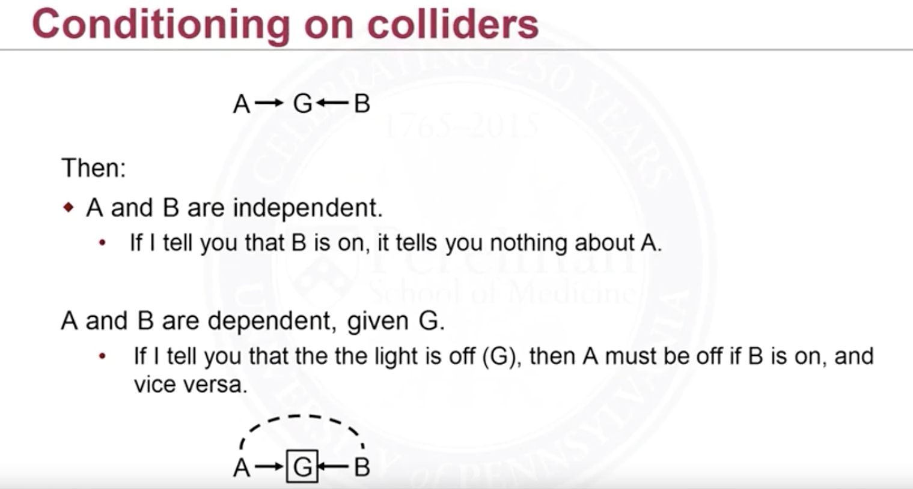

Great Example of inverted fork or colliders:

<figure>
  
  <figcaption style="text-align: center; font-family: MJXc-TeX-math-I,MJXc-TeX-math-Ix,MJXc-TeX-math-Iw; font-size: 1.1rem;">Figure 1. Example of inverted fork</figcaption>
</figure>