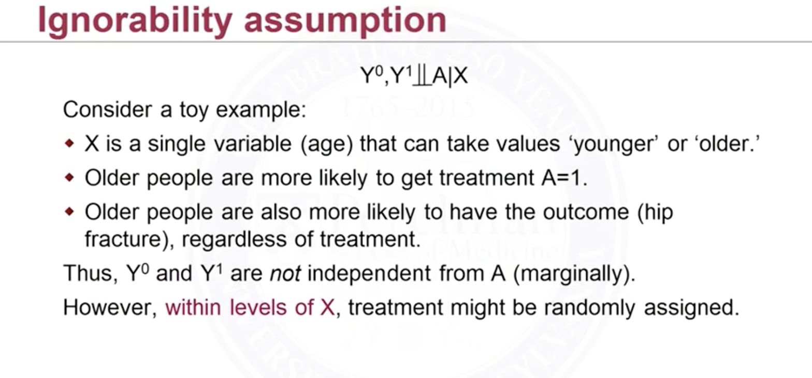
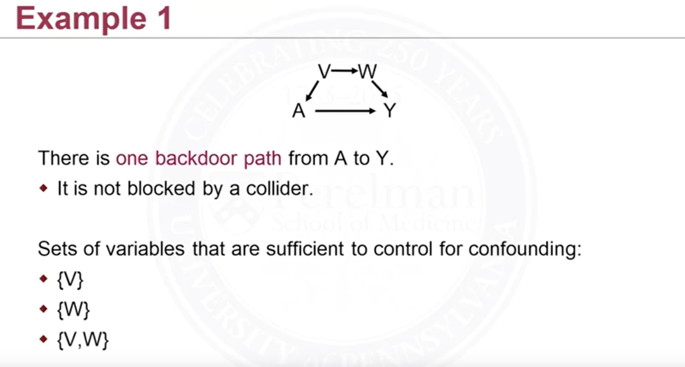

These notes do not tend to be read in order (Causal Inference is just not a field that they manage to order the concepts step by step to be taught easily). But they are in order under its own section. 

[Directed Acyclic Graphs](./directed_graph)

Randomized trials are experiments we design and conduct. They can be expensive. If people know it's randomized they will refuse to participate because they just don't won't to be bothered. And it can take a lot of time to wait for the data.

[Matching](./matching)

## Notations and General Definitions

Some notations for observed data:

- $$W_i$$ (or $$T_i$$, $$Z_i$$) $$=1$$ treated, $$=0$$ if untreated or control; these are observed in the observational experiments setting; these are assigned in control experiment
- $$Y_i$$: actual response
- $$X_i$$: other covariates (that may affect the response) 

Some notations for things that are never observed:

- $$Y_i^{W_i=0,1}$$: individual "actual" response; in reality we only know one; that is, 
  
  $$
  \begin{align}
  Y_i=\begin{cases}
  Y_i^1\ \ \mathrm{if}\ W_i=1\\
  Y_i^0\ \ \mathrm{if}\ W_i=0\\
  \end{cases}
  \end{align}
  $$
  
  Or the way I prefer, more concisely,
  
  $$
  Y_i=W_iY_i^1+(1-W_i)Y_i^0
  $$
  
- $$\tau_i=Y_i^1-Y_i^0$$ : individual treatment effect;

Things that we want: (the expectations below, if not specified, are all approximated by i.i.d)

<u>Average treatment/causal effect</u>:
$$
\begin{align}
\overline\tau&=\frac{1}{n}\sum_i^n\tau_i\\
&=\mathbb E[\tau_i]\\
&=\mathbb E[Y_i^1-Y_i^0]\\
&=\mathbb E[Y_i^1]-\mathbb E[Y_i^0]\\
\end{align}
$$

Things we have:

$$
\begin{align}
\mathbb E[Y_i\rvert W_i=1]&=\mathbb E[W_iY_i^1+(1-W_i)Y_i^0\rvert W_i=1]\\
&=\mathbb E[W_iY_i^1\rvert W_i=1]\\
&=\mathbb E[Y_i^1\rvert W_i=1]\\
\end{align}
$$

Similarly, we have:

$$
\mathbb E[Y_i\rvert W_i=0]=\mathbb E[Y_i^0\rvert W_i=0]\\
$$

But they are actually different:

$$
\begin{align}
\mathbb E[Y_i\rvert W_i=1]-\mathbb E[Y_i\rvert W_i=0]=\mathbb E[Y_i^1\rvert W_i=1]-\mathbb E[Y_i^0\rvert W_i=0]&\neq\mathbb E[Y_i^1]-\mathbb E[Y_i^0]
\end{align}
$$

Intuitively speaking, they are different because conditioning on $$W_i=1$$ or the other way around is restricting to the population receives the treatment. But the population receiving the treatment are, possibly, *more likely* to have higher potentials. For example, people at higher risk for flu (outcome) are more likely to choose to get a flu shot (treatment, meant to reduce the risk for flu). Also, this is comparing two different populations of people, whereas the true ATE is on same population. 

They are equal if and only if 

$$
(Y_i^1,Y_i^0)\perp W_i\tag{1}
$$

This is saying, the potential outcomes are independent of treatment received. More plainly, we shall assign, if possible, treatment randomly, or at least independent of potential outcomes. For example, the Federal Government consider allocating subsidies to fix water pollution to some states. Let the state's water quality be $$Y$$. Then the state shall give these money no matter the state's current water quality (this will become $$Y^0$$remain if untreated) is good or bad, and possible water quality improvement. 

You probably think that's not possible, from the perspective of policy makers. What's more probably is there are some regions $$Z_i=z_1,…z_n$$  s.t. in a region of states with poor water quality, maybe $$z_1$$, the government gives them an (somewhat) equally high amount of subsidy. And for another region, say $$z_2$$, the government give them an equally low amount of subsidy. This is saying 

$$
(Y_i^1,Y_i^0)\perp W_i\rvert Z_i\tag{2}
$$

That is, in each group, the treatment assignment is random. These groups $$z_1,..,z_n$$ may or maybe observed. More often, these groups are called *covariate* because it affects the assignment and treatment, or *confounders*. 

The condition (2) is often called *unconfoundedness*, no unmeasured confounders, or *ignorability* condition. 

## Assumptions in Summary

The following are generally called causal assumptions (those not explained here will be explained below):

- Stable Unit Treatment Value Assumptions (SUTVA)
- Consistency: what you observed (under one of the treatment) is equal to the true underlying potentials $$Y_i=Y_i^{W_i}$$ 
- Ignorability
- Positivity:  $$P(W_i=w\rvert \mathbf Z=\mathbf z)>0$$ for all $$\mathbf z,\ w=\{0,1\}$$, because if some group is never treated, $$P=0$$, then we cannot learn the effect

Assumptions can be about observed outcome $$Y_i$$, observed treatment $$W_i$$, and covariates $$Z$$.  

### Stable Unit Treatment Value Assumptions (SUTVA) 

<u>No interference</u>: units of interest do not interfere with each other. In most settings units are people. Situations that these are violated: 

- Contagion: The sickness of one people affect the other; or Vaccine 
- Behavioral Study: when people's behaviors are interacting with others 

<u>One version of treatment</u>

SUTVA allows us to write potential outcome for the ith person in terms of only that person's treatment. This simplifies the problem. 

### Ignorability

This is (2). I will elaborate it more intuitively here. The notation $$Z$$ is a bit confusing. First off, it should be a vector

$$
\mathbf Z=[Z_1,Z_2,...,Z_n]
$$

They can be ages, gender, places living in, as long as they affect both the treatment and outcomes. And this assumptions is saying: <u>Among people with the same values of $$\mathbf Z=\mathbf z$$, we can think of treatment $$W_i$$ are randomly are assigned.</u>  The following example helps:

<figure>
  <figcaption style="text-align: center; font-family: MJXc-TeX-math-I,MJXc-TeX-math-Ix,MJXc-TeX-math-Iw; font-size: 1.1rem;">Figure 1. Exmaple of Ignorability</figcaption>
</figure>

And we need to figure it out what $$\mathbf Z$$ we need to collect in order to make that assumption satisfied. 

So we can more formally define the following:

$$
\begin{align}
\mathbb E[Y_i|W_i=w, \mathbf Z=\mathbf z]&=\mathbb E[Y_i^w|W_i=w, \mathbf Z=\mathbf z](by\ consistancy)\\
&=\mathbb E[Y_i^w|\mathbf Z=\mathbf z](by\ ignorability)
\end{align}
$$

If we want *marginal causal effect*, we can average over all $$\mathbf Z=\mathbf z$$, 

$$
\begin{align}
\mathbb E[Y_i^w]&=\mathbb E_{\mathbf z}[\mathbb E[Y_i^w|\mathbf Z=\mathbf z]]\\
&=\sum_\mathbf z\mathbb E[Y_i^w|\mathbf Z=\mathbf z]P(\mathbf Z=\mathbf z)\\
\end{align}
$$

This is called *standardization* in causal inference. But in practice, it's very probable that we have some combinations of $$\mathbf z$$ that we do not have data. For instance, ??!!!…!!! So  we need an alternative to this. Common ones are mating, inverse probability weighting and propensity scores.

## Other Causal Effects

- $$\displaystyle \mathbb E[\frac{Y^1_i}{Y^0_i}]$$: causal relative risk/ratio. This would be more probable if $$Y_i$$ is a binary outcome
- $$\mathbb E[Y_i^1-Y^0_i\rvert W_i=1]$$: causal effect on the treated. We might be interested in this when we only care about the effect among the treated. 

## Confounder

Confounders are defined as variables that affect treatment and *at the same time* directly affect the outcome. Below are examples not the confounder:

- We assign treatment based on coin flip(biased or not), but the result of coin flip does not affect treatment
- People with a family history cancer are more likely to develop cancer(the outcome), but (as long as) family history is not affecting the treatment decision, then family history is not a confounder

In turns let's have a confounder example:

- If older people are at higher risk of cardiovascular(the outcome) and are more likely to receive statins(the treatment), then *age* is a confounder

Note that a set of confounders should *not* include any descendants of treatment. That is, it shall not block the front door path. A set of variables X is sufficient to control for confounding if:

- It blocks all backdoor paths from treatment to the outcome
- It does not block the front door paths 

Also this set of variables is not necessarily unique. For example: 

<figure>
  <figcaption style="text-align: center; font-family: MJXc-TeX-math-I,MJXc-TeX-math-Ix,MJXc-TeX-math-Iw; font-size: 1.1rem;">Figure 2. Exmaple of backdoor path</figcaption>
</figure>

