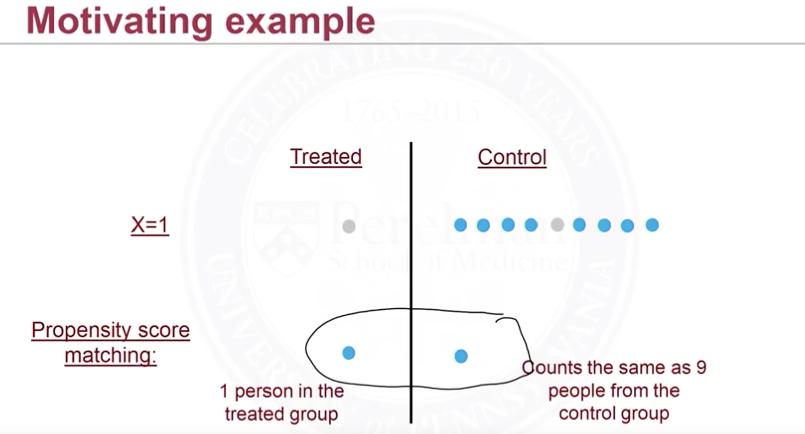

## Intuition

Propensity score can be used more than just to do *matching*. One is we can use it to perform inverse probability weighting, and then to create a pseudo-population. Let's have the following example: 

<figure>
  <figcaption style="text-align: center; font-family: MJXc-TeX-math-I,MJXc-TeX-math-Ix,MJXc-TeX-math-Iw; font-size: 1.1rem;">Figure 1. Propensity Matching Example</figcaption>
</figure>

Imagine we only have one covariate and it's binary, and propensity score for $X=1$ is $\pi(X=1)=Pr(W_i=1\vert X^{(i)}=1)=0.1$, and for $X=0$ is $\pi(X=0)=0.8$. When we do matching on $X=1$ (note we have exact same covariates on categorical variable, but on continuous we barely have this situation, then we need to do nearest neighbor matching and assess the balance), then we "cut" the relatively larger group (either treated or control, depending on propensity score). In this case we only have 1 control-group subject left. 

What we can do <u>instead</u> is to weight subjects in treated and control group differently by their propensity score. The weight is 
$$
Pr(W_i=1\vert\mathbf X^{(i)})\quad or\quad Pr(W_i=0\vert\mathbf X^{(i)})
$$
Using the same example, $\pi(X=1)=0.1$, the weight is $10$ for each subject in the treatment group and is $10/9$ for each subject in control group. Then 1 subject in the treated group can count as 10 (units of weight) and each subject in control group can only count as $10/9$ (units of weight). But they both in total have same weights 10.  

What this is in fact doing is that it creates a pseudo-population s.t. the treatment is no longer dependent on the covariates, see the following example (different from the 1st one):

<figure>
  <figcaption style="text-align: center; font-family: MJXc-TeX-math-I,MJXc-TeX-math-Ix,MJXc-TeX-math-Iw; font-size: 1.1rem;">Figure 2. IPTW Example</figcaption>
</figure>

Why in this population the treatment is no longer dependent on covariates? Because, given $\mathbf X=\mathbf x^{(i)}$ (in each group of covariates), everyone is <u>equally likely to be treated</u>. Their propensity score will all be same and it's one-half. Therefore we can view the pseudo-population as randomized experiment. 

Even not in the giving medical treatment to ill people case, it's common in real life we have different propensity scores. Maybe in giving out questionnaire, we can be more interested in younger people, teenagers and etc. This is called <u>oversampling</u>. 

### Estimator

Then, for example, how to estimate $\mathbb E[Y^{1}]$ with iptw by propensity score? Originally without propensity score, $\sum_i \mathbb E[Y^{1}]=I(W_i=1)Y_i$, or $\mathbb E[Y^{1}]=\sum_iW_iY_i$ concisely, now we need to weigh each subject by its propensity score, then
$$
\mathbb E[Y^{1}]=\frac{\sum_i^nW_iY_i/\pi_i}{\sum_i^nW_i/\pi_i}
$$
The denominator is computing the # of samples in treated group. In example 2, $n=9$ and denominator is 10. The numerator it's just the treatment effect in <u>pseudo-population</u>. The estimator for $\mathbb E[Y^0]$ is similar. This is the so-called Horvitz-Thompson(1952) estimator.

## Marginal Structure Model

Now we introduce a general model that can be used to estimate other than average causal effect $\mathbb E[Y^{1}]-\mathbb E[Y^0]$ (I actually don't know what's the benefit; I guessed when we directly compute the population average it avoids a bad probability estimate by samples). The model is
$$
\mathbb E[Y^{w}]=\beta_0+\beta_1w,\quad w=0,1
$$
And $\mathbb E[Y^1]=\beta_0+\beta_1$, $\mathbb E[Y^0]=\beta_0$, thus $\beta_1$ is the average causal effect (not condition on covariates) 

We can extend MSM to include effect modifiers (say confounders), then 
$$
\mathbb E[Y^{w}]=\beta_0+\beta_1w+\beta_2V+\beta_3wV,\quad w=0,1
$$
So, $\mathbb E[Y^1\vert V]-\mathbb E[Y^0\vert V]=\beta_1+\beta_3V$ is the treatment effect conditioning on $V$. 

## Assessing Balance

We can assess the balance by creating a table 1 like the following:

<figure>
  <figcaption style="text-align: center; font-family: MJXc-TeX-math-I,MJXc-TeX-math-Ix,MJXc-TeX-math-Iw; font-size: 1.1rem;">Figure 3. Table 1 Example</figcaption>
</figure>

Or a SMD plot:

<figure>
  <figcaption style="text-align: center; font-family: MJXc-TeX-math-I,MJXc-TeX-math-Ix,MJXc-TeX-math-Iw; font-size: 1.1rem;">Figure 4. Standardized Difference Plot</figcaption>
</figure>

## Large Weights Problem