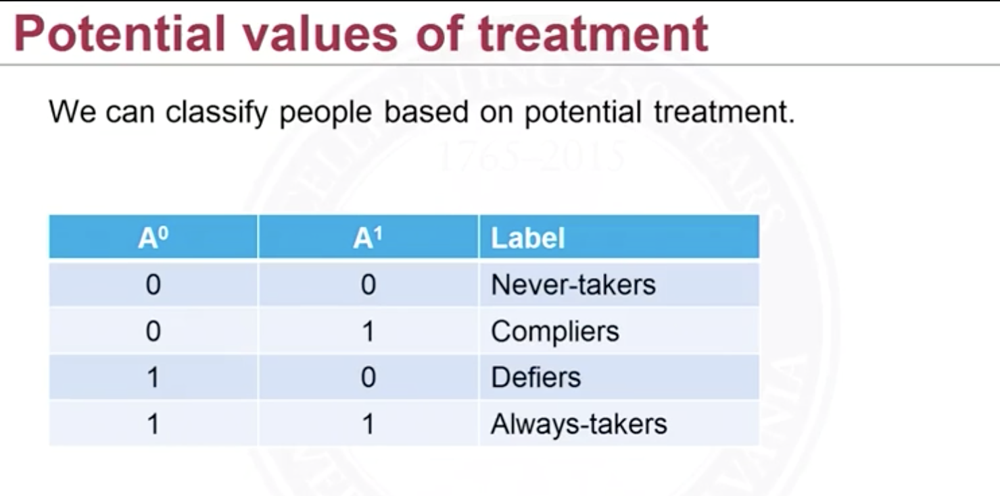
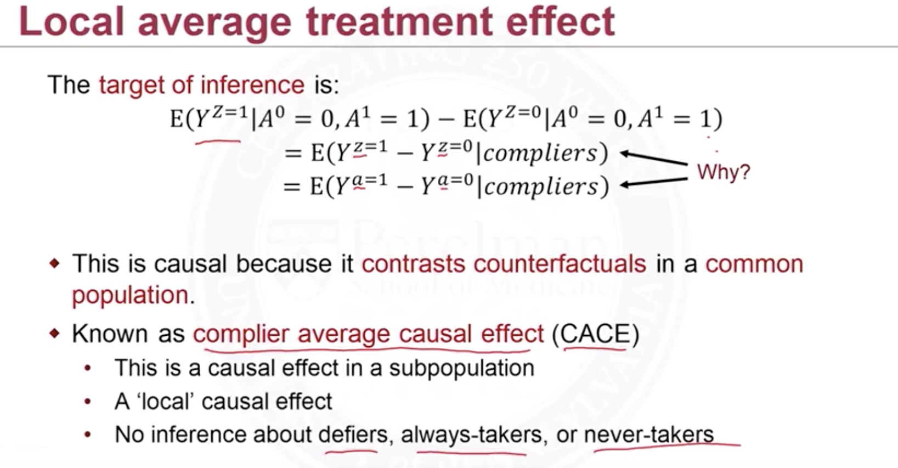
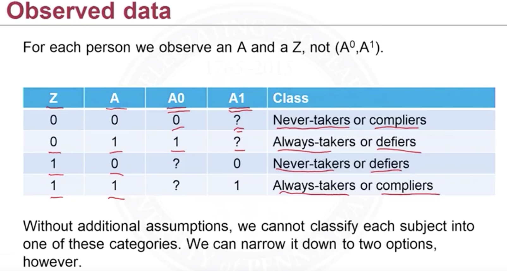
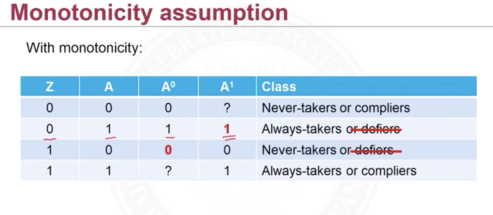

Instrumental variable is used in the case of unmeasured confounding. IV is an alternative causal inference method that <u>does not rely on the ignorability assumption</u>. An instrument is a variable $Z$ that just affect the treatment assignment $W$. It can be think of an <u>encouragement</u> which encourages or discourages the treatment but does not affect the treatment effect. The interest here is $E[Y^{Z=1}]-E[Y^{Z=0}]$  the causal effect of assignment. 

One $Z$ can be the randomized assignment of treatment. Different than $W$ treatment received(performed), a person assigned the treatment may not actually take it. This is <u>non-compliance</u>. So we're interested whether there're covariates that cause the person take the treatment or not; these can be ages, weight and something like such. In this setting, each researched subject will have two <u>potential treatments</u>, $W^{Z=1}=W^1$ and $W^{Z=0}=W^0$.  This is the same idea of potential outcome. We can set up a causal effect of treatment assignment: $E[W^1-W^0]$. This would be equal to 1 if there's perfect compliance, everyone assigned will take the treatment. We can estimate this by $E[W\vert Z=1]$ and $E[W\vert Z=0]$. 

Now, with perfect compliance (everyone is complier), the causal effect of assignment $E[Y^{Z=1}]-E[Y^{Z=0}]$ (also called the <u>intention-to-treat effect</u> ITT)will be same as the causal effect of treatment $E[Y^1]-E[Y^0]$. 

We can classify 

<figure>
  <figcaption style="text-align: center; font-family: MJXc-TeX-math-I,MJXc-TeX-math-Ix,MJXc-TeX-math-Iw; font-size: 1.1rem;">Figure 1. Classes of compliance</figcaption>
</figure>

We can expect the population of <u>defiers</u> is small because generally if we do not encourage one to receive the treatment, maybe a new drug, then this person is probably not able to take it. 

Remember IV concerns about there's unmeasured confounders. Unlike matching, IPTW and etc, IV focus on local average treatment effect. That is:

<figure>
  <figcaption style="text-align: center; font-family: MJXc-TeX-math-I,MJXc-TeX-math-Ix,MJXc-TeX-math-Iw; font-size: 1.1rem;">Figure 2. Local ATE</figcaption>
</figure>

$Y^{Z=1}$ can be directly converted to $Y^{W=1}$ in the subpopulation of compliers because of compliers' treatment assigned $Z$ is just equal to treatment received $W$.

Our goal is to have the treatment effect on *compliers*. But note that we cannot observe $(W^1,W^0)$ at the same time of one subject, we only know: 

<figure>
  <figcaption style="text-align: center; font-family: MJXc-TeX-math-I,MJXc-TeX-math-Ix,MJXc-TeX-math-Iw; font-size: 1.1rem;">Figure 3. Observed ones</figcaption>
</figure>

Therefore the compliance classes (compliers, never-takers and so on) are latent. They're known as principal strata. 

Therefore we need to have assumptions to infer these classes. The assumptions for IV are:

1. It is associated with the treatment
2. It affects the outcome only through its affect on the treatment

One more is:

1. Monotoncity assumption: no defiers 

<figure>
  <figcaption style="text-align: center; font-family: MJXc-TeX-math-I,MJXc-TeX-math-Ix,MJXc-TeX-math-Iw; font-size: 1.1rem;">Figure 4. Monotoncity Assumption</figcaption>
</figure>

## Estimate

To obtain the treatment effect on compliers $E[Y^1-Y^0\vert compliers]$, let's start with something identifiable: $E[Y^{ Z=1}-Y^{Z=0}]$, as long as $Z$ is randomized, like we randomly encourage parts of the population to receive treatment, then  $E[Y^{Z=1}-Y^{Z=0}]=E[Y\vert Z=1]-E[Y\vert Z=0]$, and we can further expand the expression:

$$
\begin{align}
E[Y^{Z=1}-Y^{Z=0}]&=E[Y\vert Z=1]-E[Y\vert Z=0]\\
&=E[Y\vert Z=1,always\ takers]P(always\ takers)\\
&+E[Y\vert Z=1,never\ takers]P(never\ takers)\\
&+E[Y\vert Z=1,compliers]P(compliers)\\
&\ -...
\end{align}
$$

We're multiplying $P(always\ takers)$ instead of $P(Z=1,always\ takers)$ because they're equal. For always takers, never takers, $Z$'s value does not affect whether they would receive the treatment, $P(Z=1,alway\ takers)=P(Z=0, always\ takers)$. Also because of this, the treatment effect of always takers and never takers will be the same, no matter their $Z$ values are. Therefore their terms in $E[Y\vert Z=1]$ and $E[Y\vert Z=0]$ will be canceled out. Also note that $P(Z=1,compliers)=P(Z=0,compliers)$ because as $Z$ is randomized, $Z$'s value will not affect whether one chooses to be a complier or not (right?). Then:

$$
\begin{align}
E[Y\vert Z=1]-E[Y\vert Z=0]&=E[Y\vert Z=1,compliers]P(compliers)\\
&-E[Y\vert Z=0,compliers]P(compliers)\\
\end{align}
$$

Dividing both side by $P(compliers)$, and work backward

$$
\begin{align}
\frac{E[Y\vert Z=1]-E[Y\vert Z=0]}{P(compliers)}&=E[Y\vert Z=1,compliers]
-E[Y\vert Z=0,compliers]\\
&=E[Y^{Z=1}-Y^{Z=0}\vert compliers]\\
&=E[Y^{1}-Y^{0}\vert compliers]
\end{align}
$$

Therefore $\frac{E[Y\vert Z=1]-E[Y\vert Z=0]}{P(compliers)}$ is the complier ace. And to get $P(compliers)$, 

$$
P(compliers)=E[W\vert Z=1]-E[W\vert Z=0]
$$

$W$ is binary so $E[W\vert Z=1]=P(W=1,Z=1)$, the proportion assigned and take, the always takers or compliers. Similar for $E[W\vert Z=0]=P(W=1,Z=0)$ the always takers (assuming no defiers). The contrast between this two is just the proportion of compliers. 

Therefore,

$$
CACE=\frac{E[Y\vert Z=1]-E[Y\vert Z=0]}{E[W\vert Z=1]-E[W\vert Z=0]}
$$

The denominator will always be between 0 and 1. If there's perfect compliance, everyone is complier, it will equal to 1. This implies that the numerator, the ITT(intention-to-treat) is an <u>underestimate</u> of CACE. 

## In Observational Studies

The challenge in observational studies is to find the appropriate instrumental variables. General ones are time and distance. Maybe drug A is prescribed less in year 1 but more in year 2. And drug B is prescribed less in year 2. This can be due to people find drug A is more effective throughout time. Then time is an encouragement for A. And time probably does not affect the patients' condition that is critical enough to affect the outcome of taking the drug. 

There're other instruments in specific situation. Generally, it's easy to find the instrument is associating with the treatment assignment. But it's hard to confirm the variable found is not affecting the outcome. 

### Two-Stage Least Square

q. 