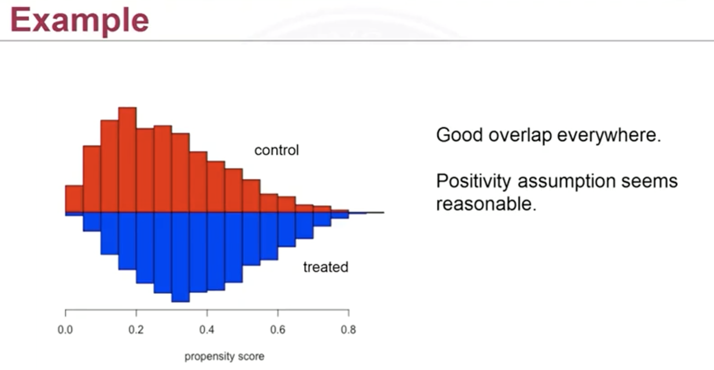

Propensity score is the <u>probability of receiving treatment</u>, given covariates $\mathbf X$, denote the propensity score for subject $i$ by $\pi_i$ (sometimes $e_i$), letting $W_i=1$ denotes receiving treatment

$$
\pi_i(\mathbf X)=Pr(W_i=1\vert\mathbf X^{(i)})\tag{1}
$$

And also note that $\pi_i$ is a function of covariates not of treatment. For example, a propensity score of 0.3 means there's 30% chance that subject $i$  receives treatment given its covariates $\mathbf X^{(i)}=\mathbf x$. For example, if there's only one covariate age, $X$, and older people were more likely to get treatment, then we can expect $Pr(W_i=1\vert age=60)>Pr(W_i=1\vert age=30)$, i.e.,

$$
\pi_i>\pi_j\quad if\ age_i>age_j
$$

### Balancing Score

Balancing score is about matching. Propensity score is a balancing score. Suppose 2 subjects have the same propensity score, but have different covariates. These two subjects then will have the same probability getting treatment. Then *if* we restrict the population to the subpopulation of subjects who have the same value propensity scores, there should be a balance between treatment and control group. More formally,

$$
Pr(\mathbf X=\mathbf x\vert \pi(\mathbf X)=p,W=1)=Pr(\mathbf X=\mathbf x\vert \pi(\mathbf X)=p,W=0)\tag{2}
$$

The implication here is that the distribution of covariates are the same between subjects in different groups as long as they have same propensity scores. One benefit of matching using propensity score is it's a scalar, unlike matching by covariates we have to match each one of them (by calculating Mahalanobis distance). 

 Once the propensity is computed (estimation), before matching, it is useful to look for <u>overlap</u> by plotting. A barplot or density plot (measuring frequencies) will be useful, the following plot is a good because it has large overlap: 

<figure>
  <figcaption style="text-align: center; font-family: MJXc-TeX-math-I,MJXc-TeX-math-Ix,MJXc-TeX-math-Iw; font-size: 1.1rem;">Figure 1. Exmaple of high overlap. The Y-axis measures the number of occurences of relative propensity score value</figcaption>
</figure>

The following plot is not good because there's limited overlap:

<figure>
  <figcaption style="text-align: center; font-family: MJXc-TeX-math-I,MJXc-TeX-math-Ix,MJXc-TeX-math-Iw; font-size: 1.1rem;">Figure 2. Exmaple of low overlap</figcaption>
</figure>

If there's trailing tail in both end, what's commonly practiced is that we can <u>trim</u> the tail by either 

- Remove control subjects whose propensity score is less than the minimum in the treatment group
- Remove treatment subjects whose score is greater than the maximum in the control group

These extreme subjects are also able to be matched because remember we match by nearest neighbors, the scores don't have to be exact. 

After this we can proceed to do <u>matching</u> by computing a distance between propensity score. What's also commonly practiced is that we can <u>stretch</u> the score to real values by $\mathrm{logit}(\pi)$. This makes many values seem similar(?). 

<u>Caliper</u> is also used if we want a better match. 

### Estimate Propensity Score

To estimate propensity score, we are estimating a probability. Therefore a logistic regression is a natural choice. We fit a logistic regression where outcome is $W_i$ and independent variables are $\mathbf X$. There're other methods as well like SVD and etc. 