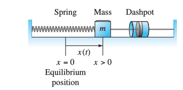
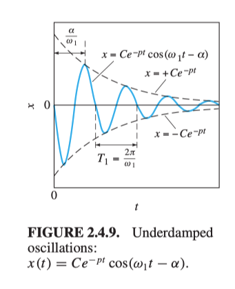

(Book 2.1 p. 101, 2.4; video 9-10)

As in Figure 1, the Spring-Mass-Dashpot system contains a *spring* that can push or pull the *mass* in order to reach the equilibrium position. At the meanwhile, the *dashpot* will *damp* (slow down) the movement, either to the left or to the right. 

<figure>
  <figcaption style="text-align: center; font-family: MJXc-TeX-math-I,MJXc-TeX-math-Ix,MJXc-TeX-math-Iw; font-size: 1.1rem;">Figure 1. A mass-spring-dashpot system </figcaption>
</figure>

More precisely, given the mass $$m$$'s position or <u>displacement</u> relative to the equilibrium position $$x$$,  the least amount of force to make it move, by Newton's Law, is 

$$
F=ma=mx''\tag{1}
$$

By Hooke's Law, the restoring force $$ F_S$$ spring exerts upon the mass is proportional to the mass's displacement: 

$$
F_S=-kx\quad  (k>0)\tag{2}
$$

So $$F_S<0$$ if $$x>0$$ (spring stretched) and $$F_S>0$$ if $$x<0$$ (spring compressed).

And by someone else's law, the force dashpot exerts upon the mass $$F_R$$ is proportional to the velocity $$v=dx/dt$$:

$$
F_R=-cv=-cx'\tag{3}
$$

If these are *all* the forces on the mass, then we have the following system

$$
\begin{array}{}
mx''&=-kx-cx'\\
mx''+cx'+kx&=0
\end{array}\tag{4}
$$

This is a homogeneous second-order linear equation governing the <u>free vibrations</u> of the mass. If there's an external force $$f(t)$$ acting on mass, then it will be added to the right

$$
mx''+cx'+kx=f(t)\tag{5}
$$

This non-homogeneous equation governs the <u>forced vibrations</u> of the mass under the influence of the external force $$f(t)$$.

## Solution Cases

We've discussed three cases of solutions to a second order linear DE with constant coefficients. In fact, the three cases, in this system, correspond to three physical phenomenon that is important to the DE. 

### Case 1: Distinct Real Roots~Overly Damped

Example:

$$
x''+4x'+3x=0
$$

Here we have an equation with mass $$m=1$$, <u>spring constant</u> $$k=3$$ and dashpot constant $$c=4$$. Note that $$c>k $$. This means we have a strong dashpot that can stop/damp the oscillation brought by the spring, and why this is called overly damp. This is easy to solve with roots $$r_1=-3,\:r_2=-1$$. Thus 

$$
x=C_1e^{-3t}+C_2e^{-1t}
$$

Suppose the initial conditions are:

$$
x(0)=1;\:x'(0)=0
$$

So at the start, the mass is on the right of the equilibrium position; and no velocity means we are not pushing it. Substituting these conditions we have

$$
x=-\frac{1}{2}e^{-3t}+\frac{3}{2}e^{-t}\tag{6}
$$

Note that we are not pushing the mass at the beginning. Imagine, if we push it to the right, it will still goes to the equilibrium position; if we push it to the left a lot, it will go pass the equilibrium position and go back. Check the following figure.

<figure>
  <figcaption style="text-align: center; font-family: MJXc-TeX-math-I,MJXc-TeX-math-Ix,MJXc-TeX-math-Iw; font-size: 1.1rem;">Figure 2. Real Roots with different initial x' </figcaption>
</figure>
The red line is what we have on (6) where $$x'(0)=0$$. If we exert a force at $$t=0$$, to the right is the blue curve, to the left is the green curve. 

### Case 3:Complex Roots~Under Damped

Example:
$$
x''+4x'+5x=0
$$
Here $$c=4,k=5$$ and $$c<k$$. We have a stronger spring, or equivalently weaker dashpot. This will lead to the spring dominates the movement and the mass moves back and forth. Solving this equation will give us $$r=-2\pm i$$. This leads to

$$
x=e^{-2t}(c_1\cos t+c_2\sin t)
$$

Suppose we have the same initial conditions 

$$
x(0)=1;\:x'(0)=0
$$

The solution is 

$$
\begin{align}
x&=e^{-2t}(\cos t+2\sin t)\\
&=\sqrt5e^{-2t}\cos(t-\tan^{-1}2)\\
\end{align}\tag{7}
$$

Here for the cosine function we have <u>Amplitude</u> $C=\sqrt 5$, <u>Circular frequency</u> $$\omega=1$$ and <u>Phase lag</u> $$\alpha=\tan^{-1}2$$. Amplitude is how wide the cosine curve will be, and phase lag is how much the curve will shift to the right, or how delayed it cosine will start equal 1. $$\displaystyle T=\frac{2\pi}{\omega}$$ is the period/time required for the object to complete one full oscillation. $$\delta=\displaystyle\frac{\alpha}{\omega}$$ is the time lag. 

Multiplying  $$e^{-2t}$$ means we have <u>time-varying</u> amplitude. Since $$\cos\in[-1,1]$$. Then  (7) will never exceed $$\sqrt5e^{-2t}$$. 

<figure>
  <figcaption style="text-align: center; font-family: MJXc-TeX-math-I,MJXc-TeX-math-Ix,MJXc-TeX-math-Iw; font-size: 1.1rem;">Figure 3. Underdamped Oscillations </figcaption>
</figure>

The figure illustrates this clearly. 

### Case 3b. Undamped

$$
mx''+kx=0\tag{8}
$$

In this case, there will be no dashpot damping the movement, the <u>damping constant</u> $$c=0$$ . The real coefficient on $$e$$ will be zero and we don't have time-varying amplitude. Example:

$$
x''+4x=0
$$

Solving this equation we have $$r=\pm 2i$$, then our solution will be 

$$
\begin{align}
x&=c_1\cos2t+c_2\sin 2t\\
\end{align}
$$

With same initial conditions $$x(0)=1,\: x'(0)=0$$, 

$$
\begin{align}
x&=\cos2t
\end{align}
$$

The mass will oscillates forever. 

### Case 2. Critically Damped

This means the damping offset the spring force equally. And we only have one root for the differential equations. This has similar graphs and physical situation as the overdamped case. They pass through the equilibrium position at most once.

## Standard Form in Engineering 

Often time, e.q. (4) will be written in another way to more easily express the damping situations, that is, from $$mx''+cx'+kx=0$$:

$$
x''+2px'+\omega_0^2x=0\tag{9}
$$

where $$2p=\displaystyle\frac{c}{m},\:\omega_0^2=\frac{k}{m}$$. By quadratic formula, we express the roots as

$$
r=\frac{2p\pm\sqrt{4p^2-4\omega_0^2}}{2}=p\pm\sqrt{p^2-\omega_0^2}\tag{10}
$$

### Undamped

No surprise is if we write the DE as (9), then if $$p=0$$, meaning no dashpot at all, $$\omega$$ is the circular frequency and the solution is 

$$
x=c_1\cos\omega_0 t+c_2\sin \omega_0 t\\
$$

### Oscillations

Examining $$r=p\pm\sqrt{p^2-\omega_0^2}$$ , we get oscillations if and only if 

$$
p<\omega_0
$$

And since $$p$$ is the real coefficients, if there's oscillations, the bound will be 

$$
Ce^{-pt}
$$

corresponding to figure 3. Recall that a complex root $$r=a\pm bi$$, $$b$$ will become the circular frequency, from [last note](./9_second_order_ode_constant_coefficients). What's $$b$$ here?

$$
\omega_1=b=\sqrt{\omega_0^2-p^2}
$$

to save the coefficients ($$bi=\sqrt{\omega_0^2-p^2}$$ b/c $$p<\omega_0$$) . And the full solution is 

$$
\begin{align}
x&=e^{-pt}(c_1\cos\omega_1t+c_2\sin\omega_1 t)\\
&=Ce^{-pt}\cos(\omega_1t-\phi)
\end{align}\tag{11}
$$

where $$C,\phi$$ deepening on the *initial conditions* and $$\omega_1,p$$ depending only on the ODE.  