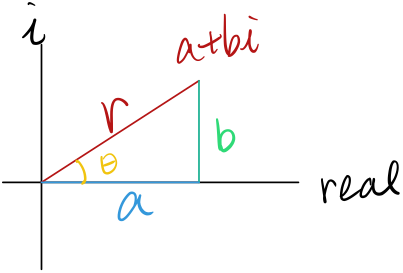

## Complex Conjugate

$$
z=a+bi;\overline z=a-bi;z\overline z=a^2+b^2
$$

To do division, we multiply top and bottom by the denominator's complex conjugate. For e.g., 

$$
\frac{2+i}{1-3i}*\frac{1+3i}{1+3i}=\frac{-1+7i}{10}=\frac{-1}{10}+\frac{7}{10}i
$$

## Polar Coordinate on Complex Numbers:

For an imaginary $$\alpha=a+bi$$

<figure>
  <figcaption style="text-align: center; font-family: MJXc-TeX-math-I,MJXc-TeX-math-Ix,MJXc-TeX-math-Iw; font-size: 1.1rem;">Figure 1. Complex number in the coordinate</figcaption>
</figure>

We can rewrite it into polar coordinates by letting $$r=\sqrt{a^2+b^2}$$ and $$\theta=\tan^{-1}(\frac{b}{a})$$,

$$
\alpha=r(\cos\theta+i\sin\theta)
$$

The angle of $$\alpha$$ is called its argument, and the tangent line is called its modulus. And Euler discovered that 

$$
e^{i\theta}=\cos\theta+i\sin\theta
$$

Rather than a proof it's more like a definition. We just take it and use it here. If you're interested in the proof, just expand both side of the equations by Taylor Series. 

With the new expression, we can rewrite $$\alpha$$:

$$
\alpha=re^{i\theta}
$$

Writing a complex number in polar form is not just nice-looking but good for multiplication:

$$
r_1e^{i\theta_1}+r_2e^{i\theta_2}=r_1r_2e^{i(\theta_1+\theta_2)}
$$

The modulus will be multiplied and the argument (angle) will be summed. 

Let's take an example: 

$$
\int e^{-x}\cos x\ dx\tag{1}
$$

We can view $$\cos x$$ as the real part of $$e^{ix}$$, that is,

$$
Re(e^{ix})=\cos x
$$

we can add another $$i\sin x$$ to the equation to form it to $$e^{ix}$$, then (1) can become

$$
\int e^{-x+ix}\ dx
$$

And we want the real part of this, which will become clearer later. 

$$
\int e^{-x+ix}\ dx=\frac{1}{-1+i}e^{(-1+i)x}
$$

We want the real part of this, not the imaginary part. One way to do that is by going into Cartesian, or multiply the complex conjugate of the denominator:

$$
\begin{align}
\frac{1}{-1+i}e^{(-1+i)x}& =\frac{1}{-1+i}e^{-x}(\cos x+i\sin x)\\
&=\frac{-1-i}{2}(\cos x+i\sin x)e^{-x}\\
&\Rightarrow(1/2)*(-\cos x+\sin x)e^{-x}\\
\end{align}
$$

This works because of *superposition of input* which we will introduce on later notes.

## Nth root of 1

? The video is unclear on this, will be added in the future