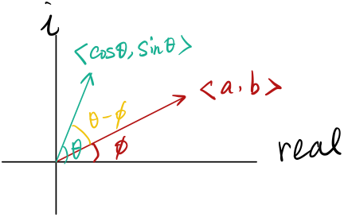

### Cartesian Form

Let's continue our problem. And we're going to use the Cartesian form. 

$$
\begin{align}
\tilde y&=\frac{1}{1+\frac{i\omega}{k}}e^{(i\omega )t}\\
&=\frac{1-\frac{\omega}{k}i}{1+(\frac{\omega}{k})^2}(\cos\omega t+i\sin\omega t)\\
&\Rightarrow\frac{1}{1+(\omega/k)^2}(\cos\omega t+\frac{\omega}{k}\sin\omega t)\\
\end{align}\tag{1}
$$

This solution does not seem to correspond to our previous one, let's work it out. One trick is that

$$
a\cos\theta+b\sin\theta=C\cos(\theta-\phi)\tag{2}
$$

where $$\phi=\tan^{-1}(\frac{b}{a})$$ is the angle between $$b$$ and $$a$$, and $$C=\sqrt{a^2+b^2}$$. Let's prove this.

<u>Proof 1</u>: First we can prove it by vectors. Remember $$\phi$$ is the angle between $$b$$ and $$a$$. Then we have the following picture 

<figure>
  <figcaption style="text-align: center; font-family: MJXc-TeX-math-I,MJXc-TeX-math-Ix,MJXc-TeX-math-Iw; font-size: 1.1rem;">Figure 1. Vector of [a,b] and [cos,sin] </figcaption>
</figure>

Let 

$$
\begin{align}
a\cos\theta+b\sin\theta&=<a,b>\cdot<\cos\theta,\sin\theta>\\
&=||<a,b>||*||<\cos\theta,\sin\theta>||*\cos(\theta-\phi)\\
&=C\cos(\theta-\phi)
\end{align}
$$

We can also prove this by going into the complex domain. Still using Figure 1 to view the angles and modulus. 

<u>Proof 2</u>:

$$
\begin{align}
a\cos\theta+b\sin\theta&=Re((a-bi)(\cos\theta+i\sin\theta))\\
&=Re(\sqrt{a^2+b^2}e^{-i\phi}*e^{i\theta})\\
&=Re(Ce^{i(\theta-\phi)})\\
&=C\cos(\theta-\phi)
\end{align}
$$

Then we can use the property right now. 

$$
\begin{align}
\tilde y&=\frac{1}{1+(\omega/k)^2}(\cos\omega t+\frac{\omega}{k}\sin\omega t)\\
&=\frac{1}{1+(\omega/k)^2}*\sqrt{1+(\omega/k)^2}\cos(\omega t-\phi)\\
&\Rightarrow\frac{1}{\sqrt{1+(\omega/k)^2}}\cos(\omega t-\phi)
\end{align}
$$

where $$\phi=\tan^{-1}(\omega/k)$$. Then we have the same solution as we did using polar form.

## Mixing problem

Image a tank containing a solution— a mixture of solute and solvent— such as salt dissolved in water. And we want to know

$$
x(t)=\mathrm{amount\ of\ salt\ in\ tank\ at\ time\ } t
$$

Suppose we have an opening on top, and a solution with concentration of $$c_i$$ grams of solute per liter of solution flows into the tank at a constant rate of $$r_i$$ litters per seconds; there's another different-sized opening in the bottom, and that solution in the tank flows out at a different constant rate of $$r_0$$ liters per second. Let $$c_0$$ be the concentration of solute in the tank, then for a very small time interval  $$\Delta t$$, the change of amount of salt in the tank is 

$$
\Delta x=\mathrm{grams\ input}-\mathrm{grams\ output}\approx (r_ic_i-r_0c_0)\Delta t
$$

If we know the volume of the liquid (solution) in the tank at time $$t$$, then we can write

$$
c_0(t)=\frac{x(t)}{V(t)}
$$

Combine all these

$$
\frac{dx}{dt}=r_ic_i-\frac{x(t)}{V(t)}r_0
$$

Writing in standard form

$$
x'+\frac{r_0}{V(t)}x=r_ic_i
$$
