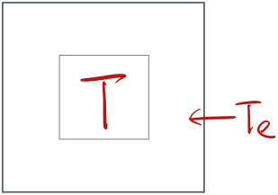
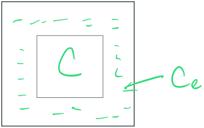

## Standard Linear Form

<u>First order linear ODE</u> is in the following form:
$$
y'+p(x)y=q(x)
$$

or nowadays the input variable $$t$$ representing time is more widely used:

$$
y'+p(t)y=q(t)
$$

This is linear because $$y$$'s exponential is 1. And we shall pay attention the coefficient of $$y'$$ is one. In this course, we shall notice that $$y$$ is written in the left-hand side. In some books $$y$$ is written on the right of the equal signs. This is the first inseparable DE we learn to solve. This type of DE has explicit solution and has many applications such as temperature concentration modeling, bank interests, exponential decay and etc. The prof. introduced the temperature model in this class.

### Temp - Concentration / Conduction - Diffusion Model

<figure>
  <figcaption style="text-align: center; font-family: MJXc-TeX-math-I,MJXc-TeX-math-Ix,MJXc-TeX-math-Iw; font-size: 1.1rem;">Figure 1. Temperature Model </figcaption>
</figure>

From Figure 1., we have some space or inner box inside a bigger box. And the temperature $$T$$ in the inner box is different than the external temperature in the bigger box $$T_e$$. Let $$t$$ denotes time, the rate that $$T$$ changes with time is:

$$
\frac{dT}{dt}=k(T_e-T)
$$

$$k$$ represents the conductivity constant. Note here we put $$T_e$$ in the left because we want $$k>0$$. This is saying that when the external temperature $$T_e$$ is greater than the internal temperature $$T$$, the inner temperature $$T$$ is increasing.  

### Diffusion

<figure>
  <figcaption style="text-align: center; font-family: MJXc-TeX-math-I,MJXc-TeX-math-Ix,MJXc-TeX-math-Iw; font-size: 1.1rem;">Figure 2. Diffusion Model</figcaption>
</figure>

For diffusion it's similar. Say we have $$C$$ as salt concentration inside, and $$C_e$$ as external salt concentration. Then the rate that the inside salt concentration increases is:

$$
\frac{dC}{dt}=k(C_e-C)
$$

## Integrating factors

Now we can talk about how to solve this type of DE. One way is by integrating factor $$u(x)$$, or $$u(t), M(t)$$ call whatever you like. The purpose of $$u(x)$$, abbreviating as $$u$$ to avoid confusion, is to make:

$$
u*(y'+p(x)y)=(uy)'\tag{1}
$$

the lefthand side the DE the derivative of $$(uy)'$$. If we can achieve this, then the DE is easily solved by finding the integration on the right-hand side. So what integrating factor $$u$$ will achieve this? Look at eq. (1) closer, expanding left-hand side:

$$
uy'+puy
$$

expanding right-hand side:

$$
uy'+u'y
$$

That is, we need to use a $$u$$ that its derivative is $$pu$$. What can we do is by seperating variables  and integrating both sides to find $$u$$: 

$$
\begin{align}
u'&=pu\\
\int\frac{1}{u}dx&=\int pdx\\
\ln|u|&=\int pdx\\
u&=e^{\int pdx}
\end{align}
$$

And remember $$p(x)$$ depending on input $$x$$, $$u=e^{\int p(x)dx}$$.Note we don't need $$+C$$ here since only one $$u$$ is needed. Let's take an example and summarize the steps:

$$
xy'-y=x^3
$$

Given a first order linear DE that may not be in standard form, we need to:

1. Write it in standard form: $$y'-\frac{1}{x}y=x^2$$
2. Calculate I.F. integrating factor $$e^{\int pdx}=e^{-\ln x}=\frac{1}{x}$$
3. Multiply both side by the I.F. :$$(\frac{y}{x})'=x$$
4. Integrate: $$\frac{y}{x}=\frac{x^2}{2}+C\Rightarrow y=\frac{x^3}{2}+Cx$$ 

### Definite Integral

When there's an initial condition $$y_0$$, we want to do definite integral from 0 to $$t$$ when integrating the right-hand side of standard first order linear ODE:

$$
\int_0^t uq\ dt
$$

(to be supplement in the future)

