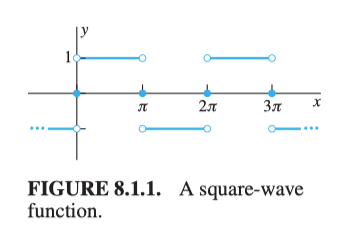

(Book 8.1)

Continuing from [note 24](../../linear_algebra/UnitII/24_markov_matrices_fourier_series) in Linear Algebra, 

Aside from the trigonometric identity that $$\displaystyle \sin^2(t)=\frac{1}{2}-\frac{1}{2}\cos2t$$, there's another way we can get the orthogonality relation such as $$\displaystyle \int_{-\pi}^{\pi}\cos(nt)\sin(mt)\:dt=0$$ , we can use DE:

$$
x''+m^2x=0
$$

What satisfies this DE? $$\sin(mt)$$ and $$\cos(nt)$$ you may recall this DE from the undamped case. Let $$u_m,v_n$$ be any two different sin or cos functions, $$m\neq n$$,then 

$$
\begin{align}
u_m''&=-m^2u_m\\
v_n''&=-n^2v_n
\end{align}
$$

And let's take have the following:

$$
\begin{align}
\int_{-\pi}^{\pi}u_m''v_n\:dt&=-m^2\int_{-\pi}^{\pi}u_mv_n\:dt\\
\int_{-\pi}^{\pi}u_mv_n''\:dt&=-n^2\int_{-\pi}^{\pi}u_mv_n\:dt\\
\end{align}\tag{1}
$$

And 

$$
\int_{-\pi}^{\pi}u_m''v_n\:dt=u_m'v_n\vert_{-\pi}^\pi-\int_{-\pi}^{\pi}u_m'v_n'\:dt=-\int_{-\pi}^{\pi}u_m'v_n'\:dt\tag{2}
$$

through integration by parts and $$u_m'v_n\vert_{-\pi}^\pi=0$$ by listing out all possible cases that $$u_m,v_n$$ may take. And (2) is symmetric, this means we connect (2) to the two integrations in (1), we have:

$$
-m^2\int_{-\pi}^{\pi}u_mv_n\:dt=-n^2\int_{-\pi}^{\pi}u_mv_n\:dt
$$

For $$m\neq n$$, this can only happens when $$\displaystyle \int_{-\pi}^{\pi}u_mv_n\:dt=0$$. Only case left is $$n=m$$, if $$u_n=v_n=\sin\, or\, \cos$$ we have nothing to prove because they are the same and evaluated to $$\pi$$. If:

$$
\int_{-\pi}^{\pi}u_nv_n\:dt=\int_{-\pi}^{\pi}\cos nt\sin nt\:dt=1/2\int_{-\pi}^{\pi}\sin 2nt\:dt
$$

This finished the proof (what a mess). 

## Square-wave function

Let's try to find the Fourier series for the square-wave function. It is on $$[-\pi,\pi]$$ 

$$
f(t)=\cases{
\begin{align}
-1\quad &if\ -\pi<t<0\\
1\quad &if\ 0<t<\pi\\
0\quad&if\ t=-\pi,0,or\ \pi
\end{align}
}
$$

It has period $$2\pi$$. 

<figure>
  <figcaption style="text-align: center; font-family: MJXc-TeX-math-I,MJXc-TeX-math-Ix,MJXc-TeX-math-Iw; font-size: 1.1rem;">Figure 1. A square-wave function</figcaption>
</figure>

Since it is not continuous from $$-\pi$$ to $$\pi$$ nor from 0 to $$2\pi$$, we need to separate the integration. 

$$
\begin{align}
a_k&=\frac{1}{\pi}\int_{-\pi}^{\pi}f(t)\cos kt\:dt\\
&=\frac{1}{\pi}\int_{-\pi}^{0}-\cos kt\:dt+\frac{1}{\pi}\int_{0}^{\pi}\cos kt\:dt\\
&=\frac{1}{\pi}\left[\frac{1}{k}-\sin kt\right]_{-\pi}^0+\frac{1}{\pi}\left[\frac{1}{k}\sin kt\right]_0^{\pi}\\
&=0
\end{align}
$$

And 

$$
\begin{align}
b_k&=\frac{1}{\pi}\int_0^{2\pi}f(t)\sin kt\:dt\\
&=\frac{1}{\pi}\int_{-\pi}^{0}-\sin kt\:dt+\frac{1}{\pi}\int_{0}^{\pi}\sin kt\:dt\\
&=\frac{1}{\pi}\left[\frac{1}{k}\cos kt\right]_{-\pi}^0+\frac{1}{\pi}\left[\frac{1}{k}-\cos kt\right]_0^{\pi}\\
&=\frac{1}{\pi k}(1-\cos k\pi)-\frac{1}{\pi k}(\cos\pi k-1)\\
&=\frac{2}{\pi k}(1-\cos k\pi)\\
&=\frac{2}{\pi k}(1-(-1)^k)
\end{align}
$$

Therefore

$$
b_k=\cases{\begin{align}
\frac{4}{\pi k}&\quad if\ k \ is\ odd\\
0&\quad if\ k\ is\ even
\end{align}}
$$

Remember $$b_k$$ is coefficients for $$\sin kt$$, so the Fourier series for the square-wave function is

$$
f(t)=\frac{4}{\pi}\sum_{k\ odd}\frac{\sin kt}{k}
$$

We can write this $$k$$ into natural number:

$$
f(t)=\frac{4}{\pi}\sum_{k=1}\frac{\sin (2k-1)t}{2k-1}
$$
