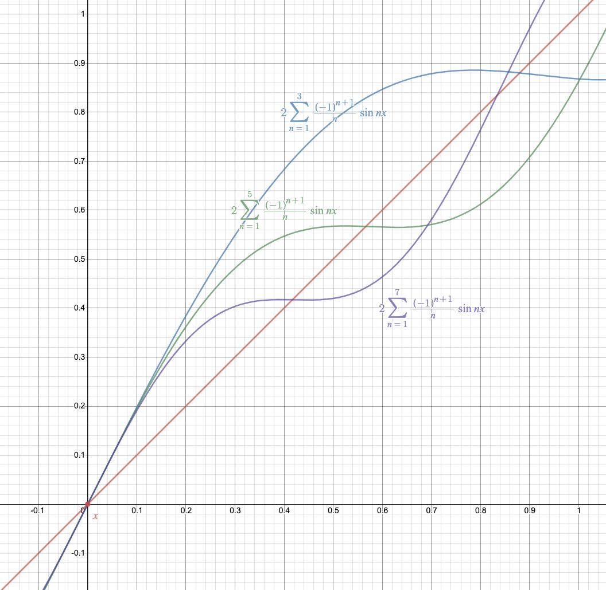

Fourier series for a period $$2\pi$$ function $f(t)$ is defined as 

$$
f(t)=\frac{a_0}{2}+\sum_{n=1}^\infty a_n\cos nt+b_n \sin nt\tag{1}
$$

where the coefficients are 

$$
\begin{align}
a_n&=\frac{1}{\pi}\int_{-\pi}^{\pi}f(t)\cos nt\:dt\tag{2}\\
b_n&=\frac{1}{\pi}\int_{-\pi}^{\pi}f(t)\sin nt\:dt\tag{3}\\
\end{align}
$$

## Shorten the Calculations

### f is even

Even function is s.t. $f(-t)=f(t)$. Odd function is $f(-t)=-f(t$). If a function is even, then its (of course this function is periodic) Fourier series only contains the cosine term. 

$$
f(t)=\frac{a_0}{2}+\sum_{n=1}^\infty a_n\cos n\pi\tag{f is even}
$$

First we see that if two functions are the same, their Fourier series must be the same because we're supposed to get the same expansion in (1), and same coefficients (2) and (3). With an even function, we have $f(-t)=f(t)$. And notice that the Fourier series for $f(-t)$:

$$
f(-t)=\frac{a_0}{2}+\sum_{n=1}^\infty a_n\cos nt-b_n \sin nt\tag{4}
$$

The sigh of sin change but cos is an even function so it's the same. The original one stays the same as (1). Use (1)+(4):

$$
\begin{align}
f(t)+f(-t)&=a_0+2\sum_{n=1}^\infty a_n\cos nt\\
2f(t)&=...\tag{$f(t)=f(-t)$}\\
f(t)&=\frac{a_0}{2}+\sum_{n=1}^\infty a_n\cos nt
\end{align}
$$
$\blacksquare$

Do quick calculations we can have: as long $f(t)$ is even, $f(t)\cos nt$ is also even. With this we can shorten the formula of $a_k$: 

$$
\begin{align}
a_n&=\frac{1}{\pi}\int_{-\pi}^{\pi}f(t)\cos nt\:dt\\
&=2\frac{1}{\pi}\int_{0}^{\pi}f(t)\cos nt\:dt
\end{align}
$$

### f is odd

Similarly, if f is odd, we can get $a_n$ is zero. Because: 

$$
-f(-t)=-\frac{a_0}{2}+\sum_{n=1}^\infty -a_n\cos nt+b_n \sin nt\tag{5}
$$

And (1)+(5):

$$
\begin{align}
f(t)-f(-t)&=2\sum_{n=1}^\infty b_n\sin nt\\
2f(t)&=...\\
f(t)&=\sum_{n=1}^\infty b_n\sin nt\tag{f is odd}
\end{align}
$$

A caveat is that odd function times odd function will still get odd functions. So we can shorten $b_k$ as well by similar form. 

## Ex. $f(t)=t$ on $[-\pi,\pi]$

Let's take a look on this example. $f(t)=t$ is an odd function. So we will only $b_n$ left and

$$
\begin{align}
b_n&=\frac{2}{\pi}\int_{0}^{\pi}t\sin nt\:dt\\
&=\frac{2}{\pi}[\left[t\frac{-\cos nt}{n}\right]_0^\pi-\int_0^\pi\frac{-\cos kt}{k}dt]\\
&=...\frac{-\pi (-1)^n}{n}+\left[\frac{\sin nt}{n^2}\right]_0^\pi\\
&=\frac{2}{\pi}\frac{-\pi (-1)^n}{n}\\
&=\frac{2(-1)^{n+1}}{n}
\end{align}
$$

 Therefore the Fourier series for $f(t)=t$ is 

$$
f(t)=2\sum_{n=1}^\infty\frac{(-1)^{n+1}}{n}\sin nt
$$

Let's take few terms to see what it looks like. Let's take 3 terms then

$$
f(t)\approx2(\frac{\sin t}{1}-\frac{\sin 2t}{2}+\frac{\sin 3t}{3})
$$

 <figure>
  <figcaption style="text-align: center; font-family: MJXc-TeX-math-I,MJXc-TeX-math-Ix,MJXc-TeX-math-Iw; font-size: 1.1rem;">Figure 1. Fourier series for f(t)=t </figcaption>
</figure>

When # of terms get larger, the approximation swings more correctly to intertwine the straight line. 

## Convergence Theorem

 If $f$ is continuous at $t_0$, then $f=sum\ of\ its\ Fourier\ Series$ at $t_0$. We see a periodic function is often not continuous at its break point like $\pi$. It jumps. If $f$ has jump discontinuity at $t_1$, then its Fourier series converges to the midpoint of the jump. 

## Extension # 1 for Fourier Series

We can generalize the period of $2\pi$ on (1) to $P=2L$, as long as $P>0$. Then the generalized version is 

$$
f(t)=\frac{a_0}{2}+\sum_{n=1}^\infty a_n\cos n\frac{\pi}L{}t+b_n \sin n\frac{\pi}{L}t\tag{5}
$$

where

$$
\begin{align}
a_n&=\frac{1}{\pi}\int_{-\pi}^{\pi}f(t)\cos n\frac{\pi}{L}t\:dt\tag{6}\\
b_n&=\frac{1}{\pi}\int_{-\pi}^{\pi}f(t)\sin n\frac{\pi}{L}t\:dt\tag{7}\\
\end{align}
$$

## Extension # 2 

If $f(t)$ is on $[0, L]$, we can do odd extension which make $[-L,0]$ is defined with $-f(t)$ or even extension with $f(-t)$. 

