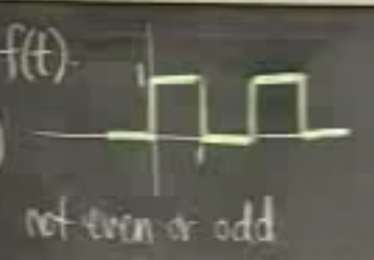
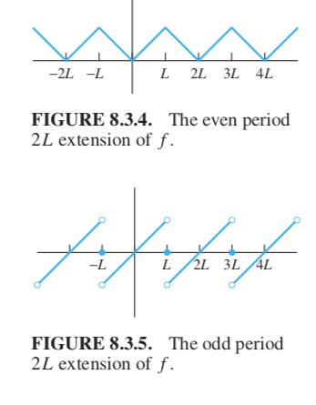

A typical periodic input is sound. Sound can consist of different tones, each tone corresponds to a sine or cosine function, and they sum up become a single periodic function. This input can be decomposed by Fourier series.  

## Techniques of Moving Fourier Series

Recall the square wave function, but let it have half-period 1 and goes between 0 and 1 instead of $-1/2$ and $1/2$. 

 <figure>
  <figcaption style="text-align: center; font-family: MJXc-TeX-math-I,MJXc-TeX-math-Ix,MJXc-TeX-math-Iw; font-size: 1.1rem;">Figure 1. Shrinked Shifted Square Wave </figcaption>
</figure>

How does one from the following go to the shrink and shifted one? 

<figure>
  <figcaption style="text-align: center; font-family: MJXc-TeX-math-I,MJXc-TeX-math-Ix,MJXc-TeX-math-Iw; font-size: 1.1rem;">Figure 1. A square-wave function</figcaption>
</figure>

Let the normal square-wave and its Fourier series be $g(u)$, the irregular one be $f(t)$. The relation between a $2\pi$ period input $u$ and general period input $t$ is $u=\displaystyle\frac{\pi}{L}t$. We have:

$$
\begin{align}
f(t)&=\frac{1}{2}g(u)+\frac{1}{2}\\
\end{align}
$$

The modified function is we squash the original one by half and shift it by 1/2 upper. Then:

$$
\begin{align}
f(t)&=\frac{1}{2}g(u)+\frac{1}{2}\\
&=\frac{1}{2}\frac{4}{\pi}\sum_{n\ odd}\frac{\sin nt}{n}+\frac{1}{2}\\
&=\frac{2}{\pi}\sum_{n\ odd}\frac{\sin nt}{n}+\frac{1}{2}
\end{align}
$$

## Fourier series Differentiation

As long as the Fourier series converges to continuous functions $f(t)$ , then the derivative of the Fourier series also converges to $f'(t)$ under the condition $f'(t)$ is smooth/differentiable on the domain. The Fourier series of $f'$ is 

$$
f'(t)=\sum_{n=1}^\infty -\frac{n\pi}{L}a_n\sin n\frac{\pi}L{}t+\frac{n\pi}{L}b_n \cos n\frac{\pi}{L}t
$$

Obtained by the termwise differentiation of the Fourier series:

$$
f(t)=\frac{a_0}{2}+\sum_{n=1}^\infty a_n\cos n\frac{\pi}L{}t+b_n \sin n\frac{\pi}{L}t
$$

## Use Fourier series to find Particular Solution

In practice, many input is not periodic, at least there're some not. If we want to apply Fourier series, we need to extend it. As long as the function's domain does not contain infinity, we can treat is as $[0,L]$ (we only assume positive domain since it's mostly time). For example, if we have $f(t)=t$ on $[0,1]$, then $L=1$. Depending on the initial value conditions, we have either odd or even extensions, see the following figure. 

 <figure>
  <figcaption style="text-align: center; font-family: MJXc-TeX-math-I,MJXc-TeX-math-Ix,MJXc-TeX-math-Iw; font-size: 1.1rem;">Figure 1. f(t)=t even and odd extensions </figcaption>
</figure>

If the conditions are $x(0)=0, x(L)=0$ we need an odd extension. After we've done the extensions, we can plug in the Fourier series $f(t)$ and $f'(t)$ into the original equation (after checking the terms not appearing in original input and derivative and etc). And follow the steps of undetermined coefficients. 

