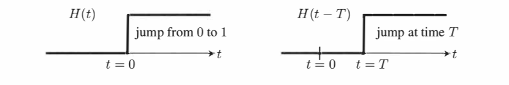
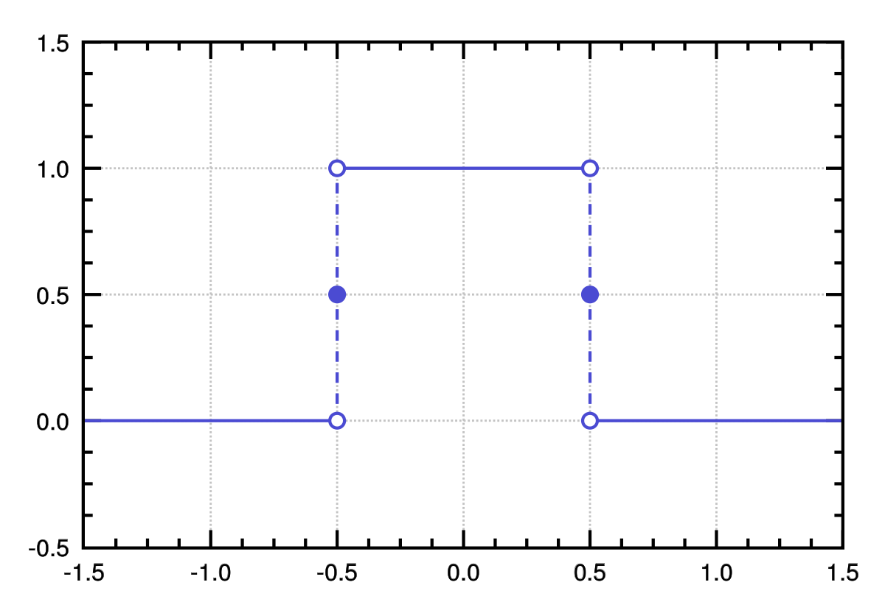
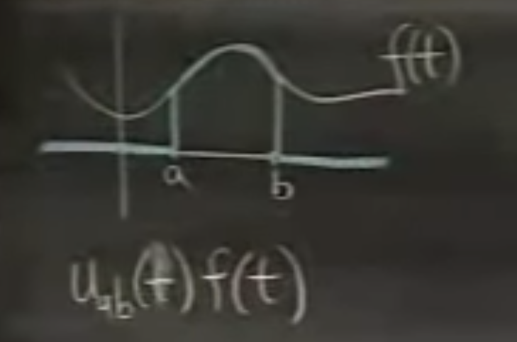
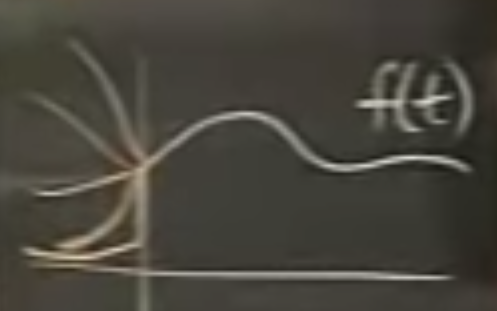
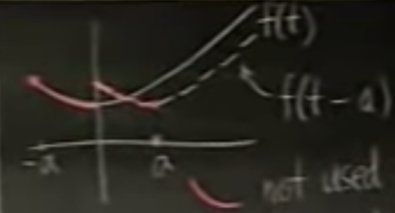
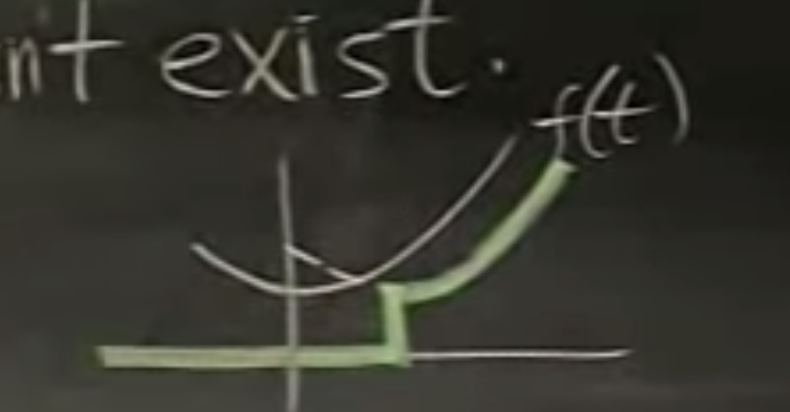

The unit step function $H(t)$ is that 

$$
H(t)=\cases{0,\ t<0\\1,\ t\geq0}\tag{1}
$$

Its graph is 

 <figure>
  <figcaption style="text-align: center; font-family: MJXc-TeX-math-I,MJXc-TeX-math-Ix,MJXc-TeX-math-Iw; font-size: 1.1rem;">Figure 1. The unit step function and its shift </figcaption>
</figure>

And we denote its shift by $H(t-T)$ or $H_T(t)$. Sometimes we also let $H(0)$ undefined just to make everyone happy. 

There's another that step up at time $t=a$ and step down at time $t=b$, making it a box, this function $u_{ab}(t)=H_a(t)-H_b(t)=H(t-a)-H(t-b)$. 

 <figure>
  <figcaption style="text-align: center; font-family: MJXc-TeX-math-I,MJXc-TeX-math-Ix,MJXc-TeX-math-Iw; font-size: 1.1rem;">Figure 2. The unit box function</figcaption>
</figure>

Why we care about such function? For example, if we want to find a Lapace transform on a function on certain interval $[a,b]$ we can multiply the function by $u_{ab}(t)$, like below

 <figure>
  <figcaption style="text-align: center; font-family: MJXc-TeX-math-I,MJXc-TeX-math-Ix,MJXc-TeX-math-Iw; font-size: 1.1rem;">Figure 3. Step box function multiply f(t)</figcaption>
</figure>

## Unique Laplace transform w/ step functions

What's the Laplace transform on <u>the step function</u> $H(t)$?

$$
\mathcal L(H(t))=\int_0^\infty \underbrace{H(t)}_{1,when\:t\geq0}e^{-st}\:dt=\frac{1}{s}
$$

This isn't a big problem, but what's $\mathcal L^{-1}(\displaystyle \frac{1}{s})$? Is it the constant 1 or the step function $H(t)$? This problem not only happens on these, but on all the functions. 

 <figure>
  <figcaption style="text-align: center; font-family: MJXc-TeX-math-I,MJXc-TeX-math-Ix,MJXc-TeX-math-Iw; font-size: 1.1rem;">Figure 4. Same Laplace transform on different functions</figcaption>
</figure>

On Figure 4., $f(t)$ with different less-than-zero values. Because Laplace transform only cares about values greater than 0, $f(t)$ with different less-than-zero values has the same Laplace transform. Therefore we want to have a unique inverse Laplace transform. This is done by multiplying the $f(t)$ by step function $H(t)$.  

First off, there's no formula that can express $\mathcal L(f(t-a))$ in terms of $\mathcal L(f(t))$, because, as in Figure 5, Laplace transform of $f(t-a)$ use values that were not used in $f(t)$. When we do Laplace transform, we've already given away the information of the negative values. \<assuming $a>0$ \>

 <figure>
  <figcaption style="text-align: center; font-family: MJXc-TeX-math-I,MJXc-TeX-math-Ix,MJXc-TeX-math-Iw; font-size: 1.1rem;">Figure 5. Negative values not used for shifted f(t)</figcaption>
</figure>

What we can do instead is we have formulas for $\mathcal L(H(t-a)\cdot f(t-a))$ in which we erase away the original negative values, as in Figure 6. 

 <figure>
  <figcaption style="text-align: center; font-family: MJXc-TeX-math-I,MJXc-TeX-math-Ix,MJXc-TeX-math-Iw; font-size: 1.1rem;">Figure 6. Shifted f(t) multiply step function</figcaption>
</figure>

The formula for that is 

$$
\begin{align}
\mathcal L(H(t-a)\cdot f(t-a))&=e^{-as}F(s)\\
\end{align}\tag{2}\\
$$

But the problem is the functions in our problems will not appear in the form of $f(t-a)$ therefore we need another formula:

$$
\mathcal L(H(t-a)\cdot f(t))=e^{-as}\mathcal L(f(t+a))\tag{3}
$$

Proof for (2):

$$
\begin{align}
\mathcal L(H(t-a)\cdot f(t-a))&=\int_0^\infty e^{-st}H(t-a)f(t-a)\:dt\\
&<let\ t_1=t-a>\\
&=\int_{-a}^\infty e^{-s(t_1+a)}H(t_1)f(t_1)\:dt\\
&=e^{-sa}\int_{-a}^\infty e^{-st_1}\underbrace{H(t_1)}_{0 \ if-a<0,1\ if-a>0}f(t_1)\:dt\\
&=e^{-as}\int_{0}^\infty e^{-st_1}f(t_1)\:dt\\
&=e^{-as}F(s)
\end{align}
$$

From (2) to (3) we can brute force it by replacing $f(t-a)$ by $f(t)$ through $t=t-a$.

### Inverse Laplace 

