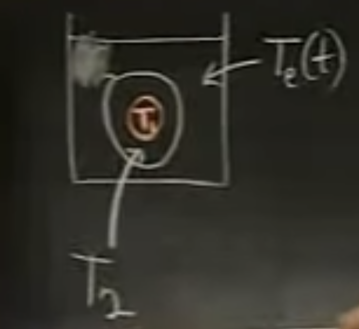

First order systems, as the name suggests, is a system of first order differential equations. They need to be solved simultaneously, not just one at a time. Similar to <u>linear</u> DE, a linear system requires the dependent variables $$\mathbf x=\begin{bmatrix}x_1&x_2&...\end{bmatrix}$$ shall not interacts with each others. For instance, $$x_1'=x_1x_2+f(t)$$ shall not appear in a linear system. A <u>homogeneous</u> one is just there's no separate $$f(t)$$. Similarly, we're interested in <u>constant coefficients</u>. 

### Initial Conditions

If we want to set initial conditions, how many shall we have? The number of unknown constants from the system is the number of total order of the system. For example:

$$
\begin{array}{}
20x'&=-6x+y\\
20y'&=6x-3y\\
\end{array}
$$

has a total order of 1+1=2. The initial conditions we typically need is $$x(0),y(0)$$. If we have a higher one:

$$
\begin{array}{}
2x''&=-6x+2y\\
y''&=2x-2y+40\sin3t\
\end{array}
$$

We need a total of 2+2=4. 

## Heat Conduction

Image we have the following model:

<figure>
  <figcaption style="text-align: center; font-family: MJXc-TeX-math-I,MJXc-TeX-math-Ix,MJXc-TeX-math-Iw; font-size: 1.1rem;">Figure 1. Conduction </figcaption>
</figure>

We have a tank filled with water, and an *egg* inside the tank. The temperature of water, we call it the external temperature, is $$T_e(t)$$. The temperature of the egg's white is $$T_1(t)$$ and the egg's yolk is $$T_2(t)$$. We expect they have different conductivity because they are made of quite different substances. Our system of equation is 

$$
\begin{align}
\frac{dT_1}{dt}&=a(T_2-T_1)\\
\frac{dT_2}{dt}&=a(T_1-T_2)+b(T_e-T_2)\\
\end{align}
$$

We expect the yolk only get heat from the white. But the white get heat simultaneous from the yolk and the water. A good way to write the system is to make things "in order":

$$
\begin{array}{ c c c c c c }
T_{1} ' & = & -aT_{1} & + & aT_{2}  \\
T_{2} ' & = & aT_{1} & - & ( a+b) T_{2} +bT_{e}
\end{array}
$$

Now, if we want something complicated, we can coddle an egg. Then the input function $$T_e=100e^{-kt}$$. But let's just icebath the egg and $$T_e=0$$. Let's have nice number $$a=2,b=3$$ to make the system come out nice. 

$$
\begin{array}{c}
T_{1} ' & = & -2T_{1} & + & 2T_{2}  \\
T_{2} ' & = & 2T_{1} & - &  5T_{2} 
\end{array}
$$

### Elimination

An easy, but uninsightful way to solve the system is by eliminating one variable. This is saying we shall write one variable totally in terms of the other and reduce # of equations. Let $$\displaystyle T_2=\frac{T_1'+2T_1}{2}$$, then:

$$
\begin{array}{c}
\frac{T_1'+2T_1}{2}' & = & 2T_{1} & - &  5\frac{T_1'+2T_1}{2}
\end{array}
$$

If you write out the equation, you will notice that we will have a second order DE.  In fact, if we're successful in eliminating to one equation, the order of this equation will be the *sum* of the order of the system. 

$$
\begin{align}
\frac{T_1'+2T_1}{2}' & = 2T_{1} - 5\frac{T_1'+2T_1}{2}\\
T_1''+2T_1'&=4T_1-5T_1'-2T_1\\
T_1''+7T_1'+6T_1&=0\\
\end{align}
$$

By characteristic equations, we have $$r_1=-6,\:r_2=-1$$. Then 

$$
T_1=c_1e^{-6t}+c_2e^{-t}
$$

Let's have initial conditions: $$T_1(0)=40,\:T_2(0)=45$$. And we shall not forget the relations between $$T_1$$ and $$T_2$$ above. 

$$
T_2=-2c_1e^{-6t}+-\frac{1}{2}c_2e^{-t}
$$

And we get $$c_1=-10,c_2=50$$. 

## Geometric Significance

