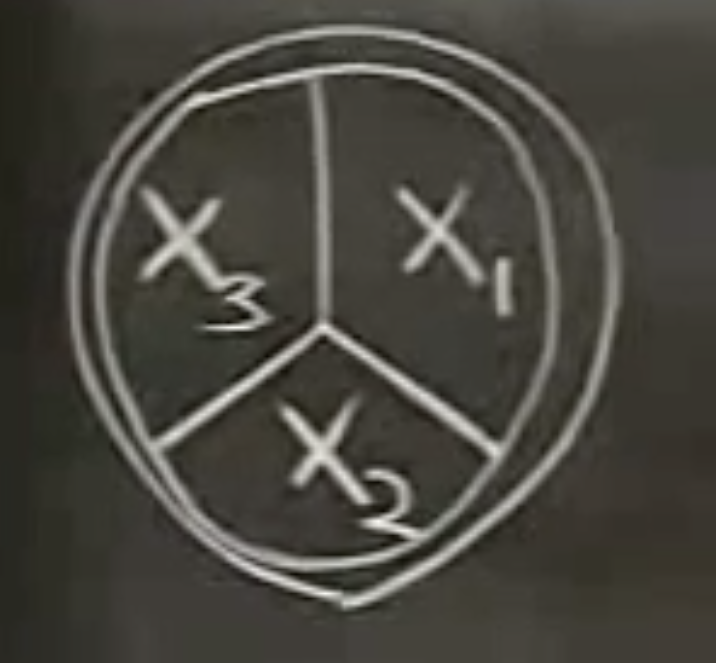

## Complete Eigenvalues

We have a fish tank divided into three compartments with different temperature:

<figure>
  <figcaption style="text-align: center; font-family: MJXc-TeX-math-I,MJXc-TeX-math-Ix,MJXc-TeX-math-Iw; font-size: 1.1rem;">Figure 1. Fish tank Model </figcaption>
</figure>

They started out at different temperature but because a guy forgets to turn on the heater and they eventually go to the same temperature. And we assume the heat cannot escape from the tank to outside— no heat exchange with outside. Since we use same glass to divide the tank, they will have same conductivity constant. Let's  write out $$x_1'$$:

$$
\begin{align}
x_1'&=a(x_3-x_1)+a(x_2-x_1)\\
&=-2ax_1+ax_2+x_3
\end{align}
$$

And you can guess the remain will be similar: Let's get rid of $$a$$ for now by making it equal to 1 (it's the eigenvector or the random variable that make the equation go zero, not important for now anyway):

$$
\begin{align}
x_1'&=-2x_1+x_2+x_3\\
x_2'&=x_1-2x_2+x_3\\
x_3'&=x_1+x_2-2x_3\\
\end{align}
$$

Then

$$
\vert A-\lambda I\vert=\begin{vmatrix}
-2-\lambda & 1 & 1\\
1 & -2-\lambda&1\\
1 & 1 & -2-\lambda
\end{vmatrix}=-(\lambda+3)^2+2-3(-2-\lambda):=0
$$

What's left is

$$
\lambda^3+6\lambda^2+9\lambda=0
$$

The solutions are $$\lambda_1=0,\lambda_2=\lambda_3=-3$$. And eigenvectors are 

$$
\lambda_1=0\sim\mathbf v_1=\begin{bmatrix}1\\1\\1\end{bmatrix}\\
\lambda_2=-3\sim\mathbf v_2=\begin{bmatrix}1\\0\\-1\end{bmatrix}\\
\lambda_3=-3\sim\mathbf v_3=\begin{bmatrix}1\\-1\\0\end{bmatrix}\\
$$

Luckily, for the same eigenvalues $$\lambda_2=\lambda_3=-3$$ we have two independent eigenvectors. This kind of good eigenvalues are called <u>complete</u> eigenvalues. And the eigenvalues that cannot give us enough independent solutions are <u>defective</u> eigenvalues. An <u>important</u> theorem that can lead to complete eigenvalues is that if we have a real symmetric matrix $$A$$, then its eigenvalues will be complete. 

## Defective Eigenvalues

Let's take a look at the bad cases. 

$$
\begin{align}
x'&=x+2y\\
y'&=-x-y
\end{align}
$$

It actually has a model to mean something, but let's just forget it. Then:

$$
A=\begin{bmatrix}
1&2\\
-1&-1
\end{bmatrix}
$$

Then the characteristic equation is 

$$
(1-\lambda)(-1-\lambda)+2=0\\
\lambda^2+1=0\\
\lambda=\pm i
$$

Then 

$$
\begin{bmatrix}
1-i & 2\\
-1 & -1-i
\end{bmatrix}\begin{bmatrix}
a_1\\
a_2
\end{bmatrix}
$$

I don't quite have a good way, probably just do elimination. Then $$\mathbf v_1=\begin{bmatrix}1\\(-1+i)/2 \end{bmatrix}$$. And then the complete trial solution is 

$$
\begin{bmatrix}1\\(-1+i)/2 \end{bmatrix}e^{it}
$$

Then we need to separate the real and imaginary part:

$$
(\begin{bmatrix}1\\-1/2 \end{bmatrix}+i\begin{bmatrix}0\\1/2 \end{bmatrix})(\cos t+i\sin t)
$$

What's left is

$$
\begin{bmatrix}x\\y \end{bmatrix}=c_1\begin{bmatrix}1\\-1/2 \end{bmatrix}\cos t-c_2\begin{bmatrix}0\\1/2 \end{bmatrix}\sin t
$$
