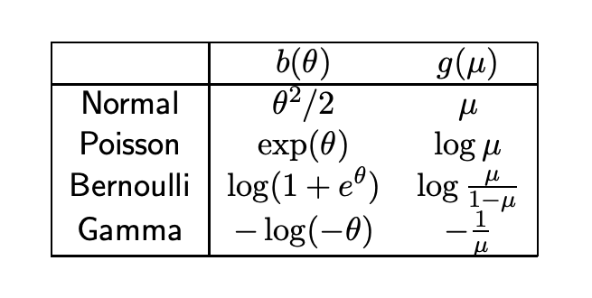

## Linear Model

A linear model assumes the data generation process is 

$$
y=\mathbf x^\top\boldsymbol\beta+\epsilon
$$

And the error $$\epsilon\sim\mathcal N(0,\sigma^2I)$$ can be measurement error, or covariates other than those in $$\mathbf x$$ that can affect $$y$$. Since $$y\sim\mathcal N(\mathbf x^\top\boldsymbol\beta,\sigma^2I)$$ is not random variable, we can just add it up to the expectation. Since this expectation depends on the value of $$\mathbf x$$, it's more proper to write $$y\vert \mathbf x\sim\mathcal N(\mathbf x^\top\boldsymbol\beta,\sigma^2I)$$. And there're some common choice to use $$Y$$ to emphasize it's a random variable. With this normal distribution assumption on the error, we have:
$$
y:=\mathbb E[Y\vert\mathbf x]
$$

## Generalized Linear Model

Let 

$$
\mu(\mathbf x):=\mathbb E[Y|\mathbb x]
$$

be the mean function of y. The word <u>mean function</u> means that this function $$\mu(·)$$ spits out the mean value of $$Y$$ (nothing special in fact). The regular linear model is:

$$
y=\mathbf x^\top\boldsymbol\beta+\epsilon\\
\mu(x)=\mathbf x^\top\boldsymbol\beta+\epsilon
$$

The generalized one is we cover the mean function with a continuous real-valued link function $$g$$ s.t. 

$$
g(y)=\mathbf x^\top\boldsymbol\beta+\epsilon
$$

This is saying in generalized linear model, the dependent variable $$y$$ that we're modeling, is not directly connected with the independent variable/predictor $$\mathbf x$$, but <u>restricted</u> through a link function $$g$$. <u>Forwardly</u>, $$g$$ is taking a random variable (distribution) $$Y$$ that may only certain ranges output it into real value. If $$Y$$ only has positive values, we need to map it into real ones because that's how we model it by $$\mathbf x^\top \beta$$. <u>Inversely</u>, the better way to think this is we have $$g^{-1}(\mathbf x^\top\beta)$$ that restricts the input to certain range like only positive values. But not all continuous $$g$$ work (I'm not sure work or good), we need continuous and increasing $$g$$ (?). In general, we want the distribution we are working on to be in the exponential family. 

## Exponential Family

Intuitively, an exponential family is a family of distribution that <u>restricts</u> the interaction between the random variable $$x$$ and the parameter $$\theta$$ of its pdf model into only a multiplication in the exponential of $$e$$. Most common distributions we've seen: Bernoulli, Binomial, Poisson, Gaussian, Gamma, Beta and so on. 

A family of distribution $$\{P_\theta:\theta\in\Theta\}, \Theta\subset\mathbb R^k$$ is said to be a <u>k-th parameter exponential family</u> on $$\mathbb R^q$$ (since $$x\in \mathbb R^q$$) if there exists 

- A vector of $$\eta_i(·), B(·)$$ of $$\theta$$
- A vector of $$T_i(·)$$ of $$x$$, $$T:\mathbb R^q\rightarrow\mathbb R^k$$ that make sure x has same dimension with the parameter 

$$
p_\theta(x)=\exp[\eta(\theta)^\top T(\mathbf x)-B(\theta)]h(x)
$$

$$B(\cdot)$$ is a normalizing factor so it doesn't matter if we put it inside or outside the exponential. $$h(\cdot)$$ is a change of measure, depending our choice, it will often be 1. 

### Two Parameter Gaussian

A two-parameter gaussian, the regular one, as we've said is a member of the exponential family. Let's check it out. Let $$X\sim\mathcal N(\mu,\sigma^2)$$, then $$\theta=(\mu,\sigma)$$, 

$$
\begin{align}
p_\theta&=\frac{1}{\sqrt{2\pi\sigma^2}}\exp(-\frac{(x-\mu)^2}{2\sigma^2})\\
&=\frac{1}{\sqrt{2\pi\sigma^2}}\exp(-\frac{x^2}{2\sigma^2}+\frac{2x\sigma}{2\sigma^2}-\frac{\mu^2}{2\sigma^2})\\
&=\exp(-\frac{x^2}{2\sigma^2}+\frac{\mu}{\sigma^2}x-(\frac{\mu^2}{2\sigma^2}+\ln\sigma\sqrt{2\pi}))
\end{align}
$$

Thus 

$$
\begin{array}{l}
T_1&=x^2\\
\eta_1&=\displaystyle -\frac{1}{2\sigma^2}\\
T_2&=x\\
\eta_2&=\displaystyle\frac{\mu}{\sigma^2}\\
B&=\displaystyle\frac{\mu^2}{2\sigma^2}+\ln\sigma\sqrt{2\pi}\\
h&=1
\end{array}
$$

Shorter is

$$
T=\begin{bmatrix}
x\\
x^2
\end{bmatrix},\eta=\begin{bmatrix}
\frac{\mu}{\sigma^2}\\
-\frac{1}{2\sigma^2}\\
\end{bmatrix}
$$

We can move $$\ln\sigma\sqrt{2\pi}$$ outside, let it be a constant function of $$h(x)$$, but it doesn't matter. 

## Canonical Exponential Family

What's better is that we can reduce the exponential family to have the random variable and the parameter to interact directly. And we have only <u>one unknown parameter</u>. 

$$
p_\theta(x)=\exp(\frac{x\theta-b(\theta)}{\phi}+c(x,\phi))\tag{*}
$$

The $$\phi$$ is the dispersion parameter that's always assume known. 

### One Parameter Gaussian

If we assume we've known the variance, Gaussian can be written in the above canonical form. Let $$\theta=\mu$$ 

$$
\begin{align}
p_\theta&=\frac{1}{\sqrt{2\pi\sigma^2}}\exp(-\frac{(x-\mu)^2}{2\sigma^2})\\
&=\frac{1}{\sqrt{2\pi\sigma^2}}\exp(-\frac{x^2}{2\sigma^2}+\frac{2x\sigma}{2\sigma^2}-\frac{\mu^2}{2\sigma^2})\\
&=\exp(-\frac{x^2}{2\sigma^2}+\frac{\mu}{\sigma^2}x-(\frac{\mu^2}{2\sigma^2}+\ln\sigma\sqrt{2\pi}))\\
&=\exp(\frac{x\mu-1/2*\mu^2}{\sigma^2}-\frac{1}{2}(\frac{x^2}{\sigma^2}+2\ln\sigma\sqrt{2\pi}))
\end{align}
$$

Therefore $$\phi=\sigma^2,b(\theta)=\mu^2/2$$

### Likelihood Property and First two moments

Two important likelihood properties for finding expectation and variance for canonical family are: (let $$\ell(\theta,…)=\log p_\theta(x)$$ be the log probability function)

$$
\mathbb E_x[\frac{\partial \ell(\theta)}{\partial\theta}]=0\\
\\
\mathbb E_x[\frac{\partial^2\ell}{\partial\theta^2}]-\mathbb E_x[(\frac{\partial \ell}{\partial\theta})^2]=0\\
$$

Proof for 1st equation

$$
\begin{align}
\frac{\partial \ell}{\partial \theta}&=\frac{\partial \log p_{\theta}(x)}{\partial \theta}=\frac{\partial p_{\theta}}{\partial\theta}\frac{1}{p_{\theta}}\\
&\Rightarrow\mathbb E[\frac{\partial \ell}{\partial\theta}]=\int p_\theta [\frac{\partial p_\theta}{\partial \theta}\frac{1}{p_\theta}]\:dx=\frac{\partial}{\partial \theta}\int p_\theta \:dx=0
\end{align}
$$

Proof for 2nd equation: …. todo

These can bring us, with $$p_\theta$$ as the canonical exponential family, $$p_\theta=\displaystyle\exp(\frac{x\theta-b(\theta)}{\phi}+c(y,\phi))$$. 

$$
0=\mathbb E_x[\frac{\partial \ell(\theta)}{\partial\theta}]=\mathbb E[\frac{x-b'(\theta)}{\phi}]\\
\Rightarrow\\
\mathbb E[x]=b'(\theta)
$$

And

$$
0=\mathbb E_x[\frac{\partial^2\ell}{\partial\theta^2}]-\mathbb E_x[(\frac{\partial\ell}{\partial\theta})^2]=\mathbb E[b''(\theta)/\phi]-\mathbb E[(\frac{x-b'(\theta)}{\phi})^2]=b''(\theta)/\phi-\frac{\mathbb V(x)}{\phi^2}\\
\Rightarrow\\
\mathbb V(x)=b''(\theta)\phi
$$

This implies that $$b(\theta)$$ needs to be strictly convex since we need its second derivative non-negative(? Probably dispersion is never negative). 

### Poisson distribution 

With these tools we can get Poisson faster. Let $$X\sim Poi(\lambda)$$, let $$\theta = \ln \lambda$$

$$
\begin{align}
p_\theta(x)&=e^{-\lambda}\frac{\lambda^x}{x!}\\
&=\exp[-\lambda+x\ln\lambda-\ln x!]\\
&=\exp[-e^\theta+x\theta-\ln x!]
\end{align}
$$

Therefore $$b(\theta)=e^\theta$$ , $$\phi=1$$, and $$c(x,\phi)=\ln x!$$. 

## Link Function

For LM, the link function $$g(·)=identity$$. 

For poisson data, where we assume that $$y\vert\mathbf x\sim Poisson(\mu(\mathbf x))$$, we need a link function that can constrain the a real-valued $$y$$, into only positive numbers $$[0,\infty)$$. A log function will be a natural one. The other way to see this is we constrain the the input $$\mathbf x^\top\boldsymbol\beta$$ to only output a positive value (technically non-negative).

For binary outcome data, we typically use logit. But there're others. In fact, the inverse cdf of all probability distribution can map binary outcome data into real values. But there're benefits that we choose the "correct" one.

### Canonical Link

<u>Canonical link</u> arises naturally from the distribution itself. The link that
$$
g(\mu)=\theta
$$
connects to the exponential family parameter (it means the parameter is in the form of exponential family like for Poisson $$\theta=e^\lambda$$) is the canonical link. Canonical link is good, since we're directly modeling one parameter of the distribution. And 
$$
\begin{align}
\mu=g^{-1}&(\theta)=b'(\theta)\\
&\Rightarrow\\
g&=b'^{-1}
\end{align}\tag{*}
$$
is strictly increasing (idk why this is good). Let's take Bernoulli as an example. 

### Bernoulli distribution

The cdf of Bernoulli:
$$
\begin{align}
p_\theta(x;p)&=p	^x(1-p)^{1-x}\\
&=\exp[x\ln p+(1-x)\ln(1-p)]\\
&=\exp[x\ln p-x\ln(1-p)+\ln(1-p)]\\
&=\exp[x\ln \frac{p}{1-p}+\ln(1-p)]
\end{align}
$$
In order to make canonical family true, need to let $$\theta=\displaystyle\ln\frac{p}{1-p}$$, then $$p=\displaystyle\frac{e^\theta}{1+e^\theta} $$. And $$\ln(1-p)=\displaystyle \ln(\frac{1}{1+e^\theta})=-\ln(1+e^\theta)$$.  This leads up to:
$$
\begin{align}
p_\theta(x;p)
&=\exp[x\ln \frac{p}{1-p}+\ln(1-p)]\\
&=\exp[x\theta-\ln(1+e^\theta)]
\end{align}
$$
This tell us $$b(\theta)=\ln(1+e^\theta)$$. Then 
$$
\begin{align}
g=(b')^{-1}&=(\frac{e^\theta}{1+e^\theta})^{-1}\\
&=\ln\frac{p}{1-p}\\
&=logit(p)
\end{align}
$$

And clearly we have a table for this 

 <figure>
  <figcaption style="text-align: center; font-family: MJXc-TeX-math-I,MJXc-TeX-math-Ix,MJXc-TeX-math-Iw; font-size: 1.1rem;">Figure 1. a graph for link functions </figcaption>
</figure>

## Log Likelihood

With all these, we start to be interested in given log likelihood, how to compute the derivative of it with respect to the weight parameter $$\displaystyle \frac{\partial \ell}{\partial\boldsymbol\beta}$$. First we need to clear out the relations between variables. 

We have 
$$
p_\theta(x)=\exp(\frac{x\theta-b(\theta)}{\phi}+c(x,\phi))\tag{*}
$$
as the [probability density function] and at the same time the log likelihood function. In the section of likelihood property, we have $$b'(\theta)=\mu(\mathbf x)$$. And if we have canonical link $$g(\mu(\mathbf x))=\theta$$,
$$
\begin{align}
\theta&=b'^{-1}(\mu(\mathbf x))\\
&=g^{-1}(b'^{-1}(\mu(\mathbf x))):=h(\mu(\mathbf x)){-1}
\end{align}
$$
We have $$h=(g\circ b')^{-1}$$. And in fact, according to (*) in canonical link section, $$h=identity$$.  