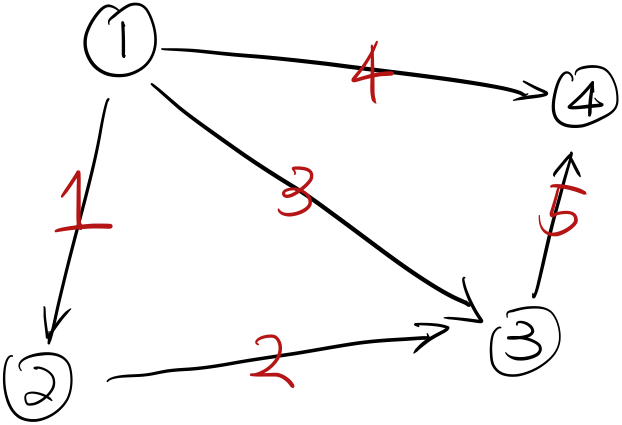
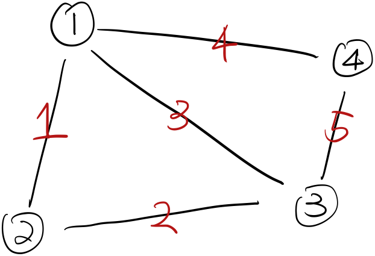

## Graph

Let's have a directed graph

<figure>
  <figcaption style="text-align: center; font-family: MJXc-TeX-math-I,MJXc-TeX-math-Ix,MJXc-TeX-math-Iw; font-size: 1.1rem;">Figure 1. Example Graph with 5 edges labeled black and four nodes labeled black</figcaption>
</figure>

here we have # of nodes $$n=4$$ and # of edges $$m=5$$. This graph can represent a lot of practical applications such as google maps modelling one location as a node and connect locations by edges, world wide web connecting each computer to another, or chemists might use row reduction to get a clearer picture of what elements go into a complicated reaction. . 

### Incidence Matrices

We will use matrices to represent a graph. Each column represents a node, starting left node 1 to right node 4. Each row represents an edge, starting from top edge 1 to bottom edge 5.

$$
A=\begin{array}{c}
\begin{matrix}
n1&n2&n3&n4\\
\end{matrix}\\
\begin{bmatrix}
-1&1&0&0\\
0&-1&1&0\\
-1&0&1&0\\
-1&0&0&1\\
0&0&-1&1
\end{bmatrix}
\end{array}
$$

-1 means going from and +1 means going to. For example, edge 1(row 1) goees from node 1 to node 2. We see that incidence matrices are sparse, meaning they have many zeros. This is because an edge can only connect two nodes. As the size of graph increases (either # of nodes or # of edges increases), the matrix will become sparser. 

### Null Space for Incidence Matrices

To find $$N(A)$$, we solve $$A\mathbf x=\mathbf 0$$:

$$
A\mathbf x=\begin{bmatrix}
-1&1&0&0\\
0&-1&1&0\\
-1&0&1&0\\
-1&0&0&1\\
0&0&-1&1
\end{bmatrix}\begin{bmatrix}
x_{1}\\
x_{2}\\
x_{3}\\
x_{4}
\end{bmatrix}=\begin{bmatrix}
x_{2} -x_{1}\\
x_{3} -x_{2}\\
x_{3} -x_{1}\\
x_{4} -x_{1}\\
x_{4} -x_{3}
\end{bmatrix} =\begin{bmatrix}
0\\
0\\
0\\
0\\
0
\end{bmatrix}
$$

From electrical physics, If the components xi of the vector x describe the electrical potential at the node $$i$$ of the graph, then $$A\mathbf x$$  is a vector describing the *difference* in potential across each edge of the graph. Except for $$\mathbf x=\mathbf 0$$, $$x_1=x_2=x_3=x_4=0$$ solves the equation as well. Thus the basis for $$N(A)$$ is

$$
\begin{bmatrix}
1\\
1\\
1\\
1\\
1
\end{bmatrix}
$$

This is saying potential difference is zero on each edge if each node has the same potential. So $$\dim N(A)=1$$ and rank $$r=4-1=3$$. From another perspective, we can check how many rows are independent by looking at loops. Note here we refer to loops in the undirected version of Figure 1. 

<figure>
  <figcaption style="text-align: center; font-family: MJXc-TeX-math-I,MJXc-TeX-math-Ix,MJXc-TeX-math-Iw; font-size: 1.1rem;">Figure 2. Undirected version of Figure 1.</figcaption>
</figure>

We can see edge 1, 2, and 3 form a loop; and edge 3,4,5 form another loop. The minimum number of edges we need to remove to remove these loops are 2. 

$$
\#\ of\ edges-\#\ of\ loops=rank\Leftrightarrow5-2=3
$$

We can also see column dependencies from this. For instance, edge 2 is a linear combination of edge 1 and 3; edge 5 is a linear combination of edge 3 and 4.

### Left Null Space for Incidence Matrices

To find $$N(A^T)$$, we solve $$A^T\mathbf y=\mathbf 0$$:

$$
\begin{bmatrix}
-1 & 0 & -1 & -1 & 0\\
1 & -1 & 0 & 0 & 0\\
0 & 1 & 1 & 0 & -1\\
0 & 0 & 0 & 1 & 1
\end{bmatrix}\begin{bmatrix}
y_{1}\\
y_{2}\\
y_{3}\\
y_{4}\\
y_{5}
\end{bmatrix}=\begin{bmatrix}
0\\
0\\
0\\
0
\end{bmatrix}\\
\Leftrightarrow\\
\begin{bmatrix}
-y_1-y_3-y_4\\
y_1-y_2\\
y_2+y_3-y_5\\
y_4+y_5
\end{bmatrix}=\begin{bmatrix}
0\\
0\\
0\\
0
\end{bmatrix}
$$

As we have known $$r=3$$ so here we know $$\dim N(A^T)=2$$. Again note that we definitely can solve $$A^T\mathbf y=\mathbf 0$$ by eliminations. But here we can do that with physics. Each $$y_i$$ correspond to an edge, $$y_1$$ to edge 1 and etc (originally each $$x_i$$ is a node).  How to make current travel in the network without collecting any charges at the node? Taking a look on Figure 1., we can do the lower loop first: go from node 1, use edge 1, edge 2 and a reversed edge 3 to go back to node 1. Then we can utilize the upper loop: edge 3, edge 5 and then reversed edge 4. So the basis for $$N(A^T)$$ is:

$$
\begin{bmatrix}
1\\
1\\
-1\\
0\\
0
\end{bmatrix} ,\begin{bmatrix}
0\\
0\\
1\\
-4\\
1
\end{bmatrix}
$$

