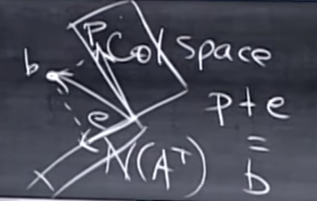

Remember our projection matrix $$P$$ is 

$$
P=A(A^\top A)^{-1}A^\top
$$

#### Prop. 1 If $\mathbf b$ in column space, $P\mathbf b=\mathbf b$;

#### Prop. 2 If $\mathbf b$ perpendicular to column space, $P\mathbf b=0$.

Let's solve **Prop. 2** First. What vectors are in perpendicular to the null space of $$A$$? From [lecture 14](./orthogonal_vectors_and_subspaces), we knew that $$R(A)\perp N(A)$$. One shall easily infer from that $$C(A)\perp N(A^\top)$$. Therefore the vectors in the left nullspace of $$A$$ are perpendicular to its column space. If $$\mathbf b$$ in $$N(A^\top)$$, then $$A^\top \mathbf b=0$$ immediately, and

$$
\mathbf p=P\mathbf b=A(A^\top A)^{-1}A^\top \mathbf b=0
$$

because we have $$A^\top \mathbf b=0$$ on the very right.

Coming back to **Prop. 1**, what is $$\mathbf b$$ if it is in the column space of $$A$$? It's $$A\mathbf x$$. Then 

$$
\begin{align}
P\mathbf b&=A(A^\top A)^{-1}A^\top A\mathbf x\\
&=A[(A^\top A)^{-1}A^\top A]\mathbf x\\
&=A\mathbf x
\end{align}
$$

$$A\mathbf x$$ is just $$\mathbf b$$. 

<figure>
  <figcaption style="text-align: center; font-family: MJXc-TeX-math-I,MJXc-TeX-math-Ix,MJXc-TeX-math-Iw; font-size: 1.1rem;">Figure 1. Geometric view of vector b projecting into A's column space, with projected vector p and e as the difference </figcaption>
</figure>

Geometrically, $$\mathbf e=\mathbf b-\mathbf p$$, $$\mathbf e$$ is also a projection, but it's just projected into the left nullspace. What's the projection matrix for $$\mathbf e$$? It is obvious when we expand $$\mathbf p+\mathbf e=\mathbf b$$:

$$
\begin{align}
\mathbf p+\mathbf e&=\mathbf b\\
P\mathbf b+\mathbf e&=\mathbf b\\
P\mathbf b+(I-P)\mathbf b&=\mathbf b
\end{align}
$$

Thus the projection matrix is just $$I-P$$.

## Least Square

<figure>
  <figcaption style="text-align: center; font-family: MJXc-TeX-math-I,MJXc-TeX-math-Ix,MJXc-TeX-math-Iw; font-size: 1.1rem;">Figure 2. A linear regression example</figcaption>
</figure>
Now let's turn to linear regression. To put it simple, linear regression is just to find a line that seems to fit a bunch of points well. But you know as long as the points are not in the straight line, we cannot have a line that perfectly goes through every points given. Therefore we need a criterion of what makes a "good" line. Here the criterion is the vertical distance between the line the points projected into the line, which would be clear a bit later. 

Let's do an example. Suppose the points' coordinates are $$(1,1), (2,2), (3,2)$$, we can substitute these points into a line's equation $$y=\beta_0+\beta_1t$$:

$$
\begin{align}
\beta_0+\beta_1&=1\\
\beta_0+2\beta_1&=2\\
\beta_0+3\beta_1&=2\\
\end{align}
$$

it's clear that there's no line can solve these equations since only horizontal line goes through (2,2) and (3,2) but horizontal line does not go through (1,1). Rewrite the equations into matrix form, let $$\boldsymbol\beta=[\beta_0,\beta_1]$$, the points x values being $$\mathbf X$$ and y values being $$\mathbf y$$:

$$
\begin{align}
\mathbf X\boldsymbol \beta&=\mathbf y\\
\begin{bmatrix}
1 & 1\\
1 & 2\\
1 & 3
\end{bmatrix}\begin{bmatrix}
\beta_0\\
\beta_1
\end{bmatrix} &=\begin{bmatrix}
1\\
2\\
3
\end{bmatrix}
\end{align}
$$

Since the equation is unsolvable, the only possible situation is that we solve the solvable ones, where $$\mathbf y$$ is projected into $$C(\mathbf X)$$. When $$\mathbf y$$ is projected into $$C(\mathbf X)$$ in the perfect way, vertically, then the projected $$\mathbf y$$ is 

$$
\begin{align}
\mathbf p&=\mathbf X\boldsymbol{\hat \beta}\\
\end{align}
$$

For $$\boldsymbol{\hat \beta}$$ is some random numbers and $$\mathbf X\boldsymbol{\hat \beta}$$ is just linear combinations of the columns of $$\mathbf X$$. Then the error is, similar to before, original subtracting the projected, 

$$
\mathbf e=\mathbf y-\mathbf X\boldsymbol{\hat\beta}
$$

This matches exactly (if you don't know it's ok) the square error statistician trying to solve:

$$
\begin{align}
\lVert\mathbf y-\mathbf X\boldsymbol\beta\rVert_2^2&=\lVert\mathbf e\rVert^2
\end{align}
$$

Thus the square error is minimized exactly when the error vector $$\mathbf e$$ is the vertical distance between the original and the projected into the column: $$\mathbf e=\mathbf y-\mathbf X\boldsymbol{\hat\beta}$$. Now let's solve for $$\mathbf p$$, i.e., $$\boldsymbol{\hat \beta}$$:

$$
\begin{align}
\mathbf X^\top(\mathbf y-\mathbf X\boldsymbol{\hat\beta})&=0\\
\boldsymbol{\hat\beta}&=(\mathbf X^\top\mathbf X)^{-1}\mathbf X^\top \mathbf y
\end{align}
$$

$$\mathbf X^\top\mathbf X$$ is invertible if and only if $$\mathbf X$$ is full column rank. When it won't be full column rank? When we have too few points and it has too many columns (i.e. predictor dimension too high). Or we have enough points but some of them are dependent. 