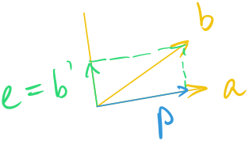

<u>Orthonormal vector</u>: Vectors $$q_1,q_2…,q_n$$ are orthonormal iff 

$$
q^\top_iq_j=\begin{cases}
0 & if\ i\neq j\\
1 & if\ i=j
\end{cases}
$$

This is saying these vectors are orthogonal to all the others, and they are normalized to have length one (unit vector). One example is $$\begin{bmatrix}1&0&…&0\end{bmatrix}, \begin{bmatrix}0&1&…&0\end{bmatrix},..,\begin{bmatrix}0&0&…&1\end{bmatrix}$$. But note that this is not the only example. Let the matrix

$$
Q=\begin{bmatrix}q_1&...&q_n\end{bmatrix}
$$

Then 

$$
Q^\top Q=
\begin{bmatrix}
q_1^\top\\
...\\
q_n^\top
\end{bmatrix}\begin{bmatrix}q_1&...&q_n\end{bmatrix}=I
$$

You can call the matrix $$Q$$ orthonormal matrix, which is a less known name. But when $$Q$$ is *square*, it's an <u>Orthogonal Matrix</u>.  The orthogonal matrix has one following property

$$
Q^\top Q=Q^{-1}Q=I\\
\Leftrightarrow\\
Q^\top=Q^{-1}
$$

Some examples of $$Q$$ are permutation matrix $$P_{ij}$$ , or

$$
\begin{bmatrix}
\cos \theta  & -\sin \theta \\
\sin \theta  & \cos \theta 
\end{bmatrix}, or\begin{bmatrix}
1 & 1 & 1 & 1\\
1 & -1 & 1 & -1\\
1 & 1 & -1 & -1\\
1 & -1 & -1 & 1
\end{bmatrix}
$$

### Projection into C(Q)

As long as we use the notation $$Q$$, it implies that the columns of $$Q$$ are orthonormal. Recall from our projection matrix formula:

$$
P=Q(Q^\top Q)^{-1}Q^\top=QIQ^\top=QQ^\top
$$

And recall when a matrix $$A$$ is full rank, $$A^\top A$$'s inverses can be factored out and we got identity matrix on $$P$$. This is saying we are projecting into nowhere, the vector is staying at the original space. $$Q^\top Q$$ is by definition equal to $$I$$, and when $$Q$$ is square, that is, $$Q$$ is an orthogonal matrix $$QQ^\top=I$$ . And remember $$A^\top A\hat{\mathbf x}=A^\top \mathbf b$$,  when $$Q$$ is *not* orthogonal, 

$$
\hat{\mathbf x}=Q^\top\mathbf b\\
\hat x_i=q^\top_i\mathbf b
$$

## Gram-Schmidt

Let's try to make a matrix's columns orthonormal. For two arbitrary vectors $$\mathbf {a,b}$$, we want to find $$a',b'$$ s.t. $$a'\perp b'$$.  And $$a', b'$$'s unit vectors are $$q_1,q_2$$ . To do so we need projections. Remember projected vector $$\mathbf p$$ is onto the space of $$A$$, and there's an error/difference $$\mathbf e=\mathbf b -\mathbf p$$. This error is in the $$N(\mathbf a^\top)$$, and it is perpendicular to the projected vector. This is what we want. (In this case $$a=a'$$)

<figure>
  <figcaption style="text-align: center; font-family: MJXc-TeX-math-I,MJXc-TeX-math-Ix,MJXc-TeX-math-Iw; font-size: 1.1rem;">Figure 1. Gram-Schmidt Illustration</figcaption>
</figure>

$$
\begin{align}
b'&=\mathbf b-\mathbf p\\
&=\mathbf b - \frac{aa^\top}{a^\top a}\mathbf b
\end{align}
$$

To verify, $$a^\top b'$$ should be equal to 0:

$$
\begin{align}
a^\top b'&=a^\top \mathbf b-a^\top\frac{aa^\top}{a^\top a}\mathbf b\\
&=a^\top \mathbf b-\not{a^\top}\frac{\not{a}a^\top}{\not{a^\top} \not{a}}\mathbf b\\
&=0
\end{align}
$$

This can be generalized from vectors $$\mathbf{a,b}$$ to a plane or a space. 

### A =QR

...