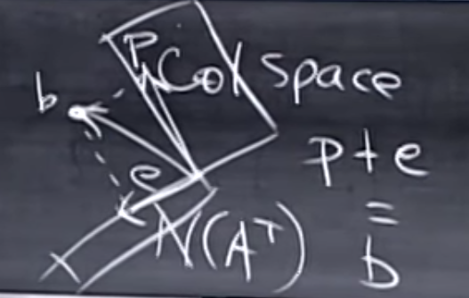
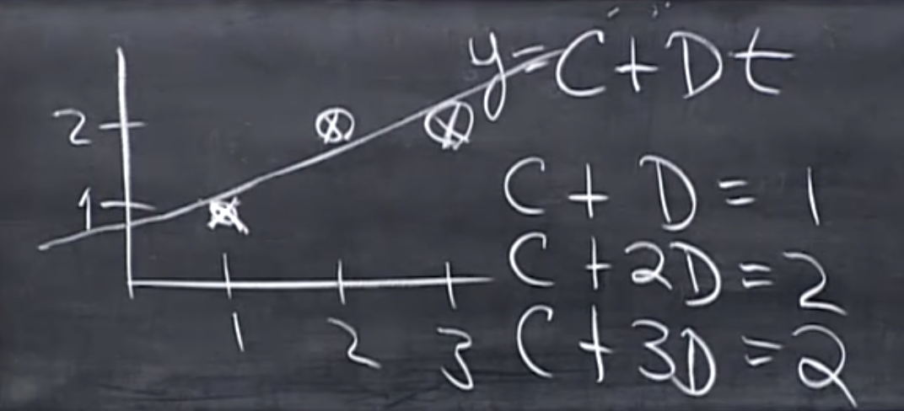

Remember our projection matrix $$P$$ is 
$$
P=A(A^\top A)^{-1}A^\top
$$

#### Prop. 1 If $\mathbf b$ in column space, $P\mathbf b=\mathbf b$;

#### Prop. 2 If $\mathbf b$ perpendicular to column space, $P\mathbf b=0$.

Let's solve **Prop. 2** First. What vectors are in perpendicular to the null space of $$A$$? From [lecture 14](./orthogonal_vectors_and_subspaces), we knew that $$R(A)\perp N(A)$$. One shall easily infer from that $$C(A)\perp N(A^\top)$$. Therefore the vectors in the left nullspace of $$A$$ are perpendicular to its column space. If $$\mathbf b$$ in $$N(A^\top)$$, then $$A^\top \mathbf b=0$$ immediately, and 
$$
\mathbf p=P\mathbf b=A(A^\top A)^{-1}A^\top \mathbf b=0
$$
because we have $$A^\top \mathbf b=0$$ on the very right.

Coming back to **Prop. 1**, what is $$\mathbf b$$ if it is in the column space of $$A$$? It's $$A\mathbf x$$. Then 
$$
\begin{align}
P\mathbf b&=A(A^\top A)^{-1}A^\top A\mathbf x\\
&=A[(A^\top A)^{-1}A^\top A]\mathbf x\\
&=A\mathbf x
\end{align}
$$
$$A\mathbf x$$ is just $$\mathbf b$$. 

<figure>
  <figcaption style="text-align: center; font-family: MJXc-TeX-math-I,MJXc-TeX-math-Ix,MJXc-TeX-math-Iw; font-size: 1.1rem;">Figure 1. Geometric view of vector b projecting into A's column space, with projected vector p and e as the difference </figcaption>
</figure>

Geometrically, $$\mathbf e=\mathbf b-\mathbf p$$, $$\mathbf e$$ is also a projection, but it's just projected into the left nullspace. What's the projection matrix for $$\mathbf e$$? It is obvious when we expand $$\mathbf p+\mathbf e=\mathbf b$$:
$$
\begin{align}
\mathbf p+\mathbf e&=\mathbf b\\
P\mathbf b+\mathbf e&=\mathbf b\\
P\mathbf b+(I-P)\mathbf b&=\mathbf b
\end{align}
$$
Thus the projection matrix is just $$I-P$$.

## Least Square

<figure>
  <figcaption style="text-align: center; font-family: MJXc-TeX-math-I,MJXc-TeX-math-Ix,MJXc-TeX-math-Iw; font-size: 1.1rem;">Figure 2. A linear regression example</figcaption>
</figure>

Now let's turn to linear regression<@introduce this in the last lec.> where we try to find a line that fit these 3 points the best. Given the points' coordinates are $$(1,1), (2,2), (3,2)$$, we can substitute these points into a line's equation $$y=C+Dt$$:
$$
\begin{align}
C+D&=1\\
C+2D&=2\\
C+3D&=2\\
\end{align}
$$
it's clear that there's no line can solve these equations. We can further verify by writing them into matrix form.
$$
\begin{align}
A\mathbf x&=\mathbf b\\
\begin{bmatrix}
1 & 1\\
1 & 2\\
1 & 3
\end{bmatrix}\begin{bmatrix}
C\\
D
\end{bmatrix} &=\begin{bmatrix}
1\\
2\\
3
\end{bmatrix}
\end{align}
$$

<Figure 3.>
<@todo Figure 3>

We define the error as the vertical distance between the line and the points: 
$$
||A\mathbf x-\mathbf b||_2^2=||\mathbf e||^2
$$
When invertible, A

Columns are sure to be independent if they are perp. Unit vectors (trivial) Orthonormal vectors 