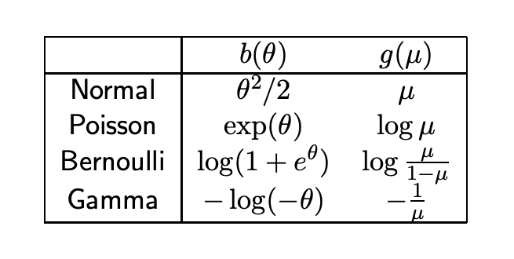

## Linear Model

A linear model assumes the data generation process is 

$$
y=\mathbf x^\top\boldsymbol\beta+\epsilon\tag{1}
$$

And the error $$\epsilon\sim\mathcal N(0,\sigma^2I)$$ can be measurement error, or covariates other than those in $$\mathbf x$$ that can affect $$y$$. Since $$y\sim\mathcal N(\mathbf x^\top\boldsymbol\beta,\sigma^2I)$$ is not random variable, we can just add it up to the expectation. Since this expectation depends on the value of $$\mathbf x$$, it's more proper to write $$y\vert \mathbf x\sim\mathcal N(\mathbf x^\top\boldsymbol\beta,\sigma^2I)$$. And there're some common choice to use $$Y$$ to emphasize it's a random variable. With this normal distribution assumption on the error, we have:
$$
y:=\mathbb E[Y\vert\mathbf x]\tag{2}
$$

## Generalized Linear Model

Let 

$$
\mu(\mathbf x):=\mathbb E[Y|\mathbb x]\tag{3}
$$

be the mean function of y. The word <u>mean function</u> means that this function $$\mu(·)$$ spits out the mean value of $$Y$$ (nothing special in fact). The regular linear model is:

$$
y=\mathbf x^\top\boldsymbol\beta+\epsilon\\
\mu(x)=\mathbf x^\top\boldsymbol\beta+\epsilon
$$

The generalized one is we cover the mean function with a continuous real-valued link function $$g$$ s.t. 

$$
g(y)=\mathbf x^\top\boldsymbol\beta+\epsilon\tag{4}
$$

This is saying in generalized linear model, the dependent variable $$y$$ that we're modeling, is not directly connected with the independent variable/predictor $$\mathbf x$$, but <u>restricted</u> through a link function $$g$$. <u>Forwardly</u>, $$g$$ is taking a random variable (distribution) $$Y$$ that may only certain ranges output it into real value. If $$Y$$ only has positive values, we need to map it into real ones because that's how we model it by $$\mathbf x^\top \beta$$. <u>Inversely</u>, the better way to think this is we have $$g^{-1}(\mathbf x^\top\beta)$$ that restricts the input to certain range like only positive values. But not all continuous $$g$$ work (I'm not sure work or good), we need continuous and increasing $$g$$ (?). In general, we want the distribution we are working on to be in the exponential family. 

## Exponential Family

Intuitively, an exponential family is a family of distribution that <u>restricts</u> the interaction between the random variable $$x$$ and the parameter $$\theta$$ of its pdf model into only a multiplication in the exponential of $$e$$. Most common distributions we've seen: Bernoulli, Binomial, Poisson, Gaussian, Gamma, Beta and so on. 

A family of distribution $$\{P_\theta:\theta\in\Theta\}, \Theta\subset\mathbb R^k$$ is said to be a <u>k-th parameter exponential family</u> on $$\mathbb R^q$$ (since $$x\in \mathbb R^q$$) if there exists 

- A vector of $$\eta_i(·), B(·)$$ of $$\theta$$
- A vector of $$T_i(·)$$ of $$x$$, $$T:\mathbb R^q\rightarrow\mathbb R^k$$ that make sure x has same dimension with the parameter 

$$
p_\theta(x)=\exp[\eta(\theta)^\top T(\mathbf x)-B(\theta)]h(x)\tag{5}
$$

$$B(\cdot)$$ is a normalizing factor so it doesn't matter if we put it inside or outside the exponential. $$h(\cdot)$$ is a change of measure, depending our choice, it will often be 1. 

### Two Parameter Gaussian

A two-parameter gaussian, the regular one, as we've said is a member of the exponential family. Let's check it out. Let $$X\sim\mathcal N(\mu,\sigma^2)$$, then $$\theta=(\mu,\sigma)$$, 

$$
\begin{align}
p_\theta&=\frac{1}{\sqrt{2\pi\sigma^2}}\exp(-\frac{(x-\mu)^2}{2\sigma^2})\\
&=\frac{1}{\sqrt{2\pi\sigma^2}}\exp(-\frac{x^2}{2\sigma^2}+\frac{2x\sigma}{2\sigma^2}-\frac{\mu^2}{2\sigma^2})\\
&=\exp(-\frac{x^2}{2\sigma^2}+\frac{\mu}{\sigma^2}x-(\frac{\mu^2}{2\sigma^2}+\ln\sigma\sqrt{2\pi}))
\end{align}
$$

Thus 

$$
\begin{array}{l}
T_1&=x^2\\
\eta_1&=\displaystyle -\frac{1}{2\sigma^2}\\
T_2&=x\\
\eta_2&=\displaystyle\frac{\mu}{\sigma^2}\\
B&=\displaystyle\frac{\mu^2}{2\sigma^2}+\ln\sigma\sqrt{2\pi}\\
h&=1
\end{array}
$$

Shorter is

$$
T=\begin{bmatrix}
x\\
x^2
\end{bmatrix},\eta=\begin{bmatrix}
\frac{\mu}{\sigma^2}\\
-\frac{1}{2\sigma^2}\\
\end{bmatrix}
$$

We can move $$\ln\sigma\sqrt{2\pi}$$ outside, let it be a constant function of $$h(x)$$, but it doesn't matter. 

## Canonical Exponential Family

What's better is that we can reduce the exponential family to have the random variable and the parameter to interact directly. And we have only <u>one unknown parameter</u>. 

$$
p_\theta(x)=\exp(\frac{x\theta-b(\theta)}{\phi}+c(x,\phi))\tag{6}
$$

The $$\phi$$ <u>is the dispersion parameter that's always assumed known</u>. And we assume it's <u>always non-negative</u>. 

### One Parameter Gaussian

If we assume we've known the variance, Gaussian can be written in the above canonical form. Let $$\theta=\mu$$ 

$$
\begin{align}
p_\theta&=\frac{1}{\sqrt{2\pi\sigma^2}}\exp(-\frac{(x-\mu)^2}{2\sigma^2})\\
&=\frac{1}{\sqrt{2\pi\sigma^2}}\exp(-\frac{x^2}{2\sigma^2}+\frac{2x\sigma}{2\sigma^2}-\frac{\mu^2}{2\sigma^2})\\
&=\exp(-\frac{x^2}{2\sigma^2}+\frac{\mu}{\sigma^2}x-(\frac{\mu^2}{2\sigma^2}+\ln\sigma\sqrt{2\pi}))\\
&=\exp(\frac{x\mu-1/2*\mu^2}{\sigma^2}-\frac{1}{2}(\frac{x^2}{\sigma^2}+2\ln\sigma\sqrt{2\pi}))
\end{align}
$$

Therefore $$\phi=\sigma^2,b(\theta)=\mu^2/2$$

### Likelihood Property and First two moments

Two important likelihood properties for finding expectation and variance for canonical family are: (WLOG, assuming we have only scalar $x$, let $$\ell(\theta,…)=\log p_\theta(x)$$ be the log probability function)

$$
\mathbb E_x[\frac{\partial \ell(\theta)}{\partial\theta}]=0\\
\\
\mathbb E_x[\frac{\partial^2\ell}{\partial\theta^2}]-\mathbb E_x[(\frac{\partial \ell}{\partial\theta})^2]=0\\
$$

Both of which are obtained from the [notes](./mle) in the section of fisher information. 

These can bring us, with $$p_\theta$$ as the canonical exponential family, $$p_\theta=\displaystyle\exp(\frac{x\theta-b(\theta)}{\phi}+c(y,\phi))$$. 

$$
\begin{align}
0&=\mathbb E_x[\frac{\partial \ell(\theta)}{\partial\theta}]\\
&=\mathbb E[\frac{x-b'(\theta)}{\phi}]\\
&\Rightarrow\\
\mathbb E[x]&=b'(\theta)
\end{align}\tag{7}
$$

And

$$
\begin{align}
0&=\mathbb E_x[\frac{\partial^2\ell}{\partial\theta^2}]-\mathbb E_x[(\frac{\partial\ell}{\partial\theta})^2]\\
&=\mathbb E[b''(\theta)/\phi]-\mathbb E[(\frac{x-b'(\theta)}{\phi})^2]\\
&=b''(\theta)/\phi-\frac{\mathbb V(x)}{\phi^2}\\
&\Rightarrow\\
\mathbb V(x)&=b''(\theta)\phi
\end{align}\tag{8}
$$

This implies that $$b(\theta)$$ needs to be strictly convex since we need its second derivative non-negative(? Probably dispersion is never negative). 

### Poisson distribution 

With these tools we can get Poisson faster. Let $$X\sim Poi(\lambda)$$, let $$\theta = \ln \lambda$$

$$
\begin{align}
p_\theta(x)&=e^{-\lambda}\frac{\lambda^x}{x!}\\
&=\exp[-\lambda+x\ln\lambda-\ln x!]\\
&=\exp[-e^\theta+x\theta-\ln x!]
\end{align}
$$

Therefore $$b(\theta)=e^\theta$$ , $$\phi=1$$, and $$c(x,\phi)=\ln x!$$. 

## Link Function

For LM, the link function $$g(·)=identity$$. 

For poisson data, where we assume that $$y\vert\mathbf x\sim Poisson(\mu(\mathbf x))$$, we need a link function that can constrain the a real-valued $$y$$, into only positive numbers $$[0,\infty)$$. A log function will be a natural one. The other way to see this is we constrain the the input $$\mathbf x^\top\boldsymbol\beta$$ to only output a positive value (technically non-negative).

For binary outcome data, we typically use logit. But there're others. In fact, the inverse cdf of all probability distribution can map binary outcome data into real values. But there're benefits that we choose the "correct" one.

### Canonical Link

<u>Canonical link</u> arises naturally from the distribution itself. The link that

$$
g(\mu)=\theta
$$

connects to the exponential family parameter (it means the parameter is in the form of exponential family like for Poisson $$\theta=e^\lambda$$) is the canonical link. Canonical link is good, since we're directly modeling one parameter of the distribution. And 

$$
\begin{align}
\mu=g^{-1}&(\theta)=b'(\theta)\\
&\Rightarrow\\
g&=b'^{-1}
\end{align}\tag{9}
$$

is strictly increasing (idk why this is good). Let's take Bernoulli as an example. 

### Bernoulli distribution

The cdf of Bernoulli:

$$
\begin{align}
p_\theta(x;p)&=p	^x(1-p)^{1-x}\\
&=\exp[x\ln p+(1-x)\ln(1-p)]\\
&=\exp[x\ln p-x\ln(1-p)+\ln(1-p)]\\
&=\exp[x\ln \frac{p}{1-p}+\ln(1-p)]
\end{align}
$$

In order to make canonical family true, need to let $\theta=\displaystyle\ln\frac{p}{1-p}$, then $p=\displaystyle\frac{e^\theta}{1+e^\theta} $. And $\ln(1-p)=\displaystyle \ln(\frac{1}{1+e^\theta})=-\ln(1+e^\theta)$.  This leads up to:

$$
\begin{align}
p_\theta(x;p)
&=\exp[x\ln \frac{p}{1-p}+\ln(1-p)]\\
&=\exp[x\theta-\ln(1+e^\theta)]
\end{align}
$$

This tell us $$b(\theta)=\ln(1+e^\theta)$$. Then 

$$
\begin{align}
g=(b')^{-1}&=(\frac{e^\theta}{1+e^\theta})^{-1}\\
&=\ln\frac{p}{1-p}\\
&=logit(p)
\end{align}
$$

And certainly we have a table for this 

 <figure>
  <figcaption style="text-align: center; font-family: MJXc-TeX-math-I,MJXc-TeX-math-Ix,MJXc-TeX-math-Iw; font-size: 1.1rem;">Figure 1. a graph for link functions </figcaption>
</figure>

## MLE

With all these, we start to be interested in given log likelihood, how to compute the derivative of it with respect to the weight parameter $\displaystyle \frac{\partial \ell}{\partial\boldsymbol\beta}$. 

### With data

Assume we have data $\mathcal D=(\mathbf x_1,y),…,(\mathbf x_n,y_n)$, and compose all the independent variables into $$\mathbf X=\begin{bmatrix} \mathbf x_1^\top\\\vdots\\\mathbf x_n^\top\end{bmatrix}$$ , and $$\mathbf y=\begin{bmatrix}  y_1\\\vdots\\y_n\end{bmatrix}$$.  

### From $\theta$ to $\beta$ 

Given the data, I can start using $Y$ as the random variable s.t. $p_\theta(y)=Pr(Y=y;\theta)$.  This aligns with the assumption at the beginning that in GLM, the dependent variable $Y$ is in exponential family. Therefore we have

$$
p_\theta(y)=\exp(\frac{y\theta-b(\theta)}{\phi}+c(y,\phi))\tag{10}
$$

as the [probability density function] and at the same time the log likelihood function of a single $y$. In the section of likelihood property, we have $b'(\theta)=\mu(\mathbf x)$. And from as the fundamental assumption of GLM, we have $g(\mu(\mathbf x))=\mathbf x^\top\boldsymbol\beta$. Then:

$$
\begin{align}
\theta&=b'^{-1}(\mu(\mathbf x))\\
&=b'^{-1}(g^{-1}(\mathbf x^\top \boldsymbol\beta)):=h(\mathbf x^\top\boldsymbol\beta)
\end{align}\tag{11}
$$

We have $$h=(g\circ b')^{-1}$$. If we have canonical link, $$h=identity$$, according to (9) in the canonical link section.

Since we're dealing with data, it's more appropriate to label $\mathbf x^\top\boldsymbol\beta$ as $\mathbf x_i^\top\boldsymbol\beta$. Think that we're on the processing of infering the correct $\boldsymbol\beta$. This leads to $\theta$ is also per $\mathbf x_i$:

$$
\theta_i=h(\mathbf x_i^\top \boldsymbol\beta)\tag{12}
$$

And therefore

$$
Y_i\sim\mathrm{Exp\ Family(\theta_i)\Leftrightarrow}Y_i\sim\mathrm{Exp\ Family}(h(\mathbf x_i^\top \boldsymbol \beta))
$$

### Log likelihood

Then we can express the log likelihood as 

$$
\begin{align}
\ell(\theta_i;\mathcal D)&=\log\prod_{(\mathbf x_i,y_i)\in\mathcal D}p_{\theta_i}(y_i)\\
&=\sum_{(\mathbf x_i,y_i)\in\mathcal D}(\frac{y_i\theta_i-b(\theta_i)}{\phi}+c(y_i,\phi))\tag{13}\\
(\ell(\beta;\mathcal D))&=\sum_{(\mathbf x_i,y_i)\in\mathcal D}(\frac{y_ih(\mathbf x_i^\top\boldsymbol\beta)-b(h(\mathbf x_i^\top\boldsymbol\beta))}{\phi}+c(y_i,\phi))
\end{align}
$$

If we have canonical link, $h(·)$ is identity:

$$
\begin{align}
\ell(\beta;\mathcal D)&=\sum_{(\mathbf x_i,y_i)\in\mathcal D}(\frac{y_i\mathbf x_i^\top\boldsymbol\beta-b(\mathbf x_i^\top\boldsymbol\beta)}{\phi}+c(y_i,\phi))
\end{align}\tag{14}
$$

Taking the derivative w.r.t. $\beta$ we can eliminate $$c(y_i,\phi)$$. What's left it's a constant $$\phi$$, and two terms related to $$\beta$$. The log likelihood does not have analytical solution. So we care about if the function is concave (or negative convex) so we have a theoretical guarantee a sequential approximation method can converge. W.r.t $\beta$ , $y_i\mathbf x_i^\top\boldsymbol\beta$ is linear. What about $b(·)$? We already know that $b''(\theta)\phi=\mathbb V(x)$. Thus as long as $\phi>0$, $b$ will be strictly convex. Then a negative convex function will lead to concave. So the whole function $\ell(\beta,\mathcal D)$ is <u>concave</u>.

## Methods for $\boldsymbol\beta$

### Newton-Raphson and Fisher-scoring

Newton methods can be used to approximate $x$ values in a function $f(x)$. Linear approximation (Euler's Method) is approximating the $y$ value by derivative at a starting point (and iteratively next points and so on). Newton methods use derivative as well but the reciprocal so that we're moving $x$. Specifically, if we want to find a point $$x^*$$ s.t. $$f(x^*)=0$$, then 

$$
x^*\approx x_0-\frac{f(x_0)}{f'(x_0)}
$$

Similarly, if we want to find a point s.t. the derivative of its log likelihood is zero $$\ell'(\theta^*)=0$$, we just use the second derivative:

$$
\theta^*\approx\theta_0-\frac{\ell'(\theta_0)}{\ell''(\theta_0)}
$$

These can be done a lot of times getting $\theta_1,\theta_2,…$ and etc. to get a better approximation. Generalized to the multivariate case $$\displaystyle \theta^*=\theta_0-\frac{\nabla_{\theta}\ell(\theta_0)}{\nabla^2_\theta\ell(\theta_0)}$$, the thing in the denominator is the Hessian matrix $H_\ell$, and we need vectors and so on:

$$
\displaystyle \theta^*\approx\theta_0-H_\ell(\theta_0)^{-1} \nabla_\theta\ell(\theta_0)\tag{15}
$$

Now the Fisher scoring comes to play. Remember the Fisher information is also the negative expectation of second derivative of log probability (likelihood):

$$
\mathcal I(\theta)=-\mathbb E[H_\ell]
$$

Since the Fisher matrix and its inverse is easier to compute (because it's a vector of gradient times a vector of gradient), we can replace the Hessian with Fisher:

$$
\displaystyle \theta^*\approx\theta_0+\hat{\mathcal I}_\ell(\theta_0)^{-1} \nabla_\theta\ell(\theta_0)\tag{16}
$$

(note a sign change) Notice that the Fisher matrix requires the parameter to be "true" $$\theta^*$$, here we don't. In fact, if we have canonical link, the Fisher matrix is always equal to the Hessian matrix (negative).

### Iterated Re-weighted Least Square (IRLS)

Let's finish what we didn't finish in e.q. (13), not (14) because it's a pain, take the derivative:

$$
\begin{align}
\frac{\partial \ell }{\partial \boldsymbol{\beta }} & =\sum ^{n}_{i=1}\frac{\partial \ell }{\partial \theta _{i}} *\frac{\partial \theta _{i}}{\partial \boldsymbol{\beta }}\\
 & =\sum ^{n}_{i=1}\frac{y_{i} -\mu _{i}}{\phi } h'\left(\mathbf{x}^{\top }_{i}\boldsymbol{\beta }\right)\mathbf{x}^{\top }_{i}\tag{by 11 and 12}\\
 & =\sum ^{n}_{i=1} y_{i} -\mu _{i}\frac{h'\left(\mathbf{x}^{\top }_{i}\boldsymbol{\beta }\right)\mathbf{x}^{\top }_{i}}{\phi }\\
 & =\sum ^{n}_{i=1} g'( \mu _{i})( y_{i} -\mu _{i})\frac{h'\left(\mathbf{x}^{\top }_{i}\boldsymbol{\beta }\right)\mathbf{x}^{\top }_{i}}{g'( \mu _{i}) \phi }\\
 & =\sum ^{n}_{i=1}\left(\tilde{y}_{i} -\tilde{\mu }_{i}\right) W_{i}\mathbf{x}^{\top }_{i}
\end{align}
$$

By letting $$\tilde{y}_i=g'(\mu_i)y_i$$, $$\tilde{\mu}_i=g'(\mu_i)\mu_i$$, and $\displaystyle W_i=\frac{h'\left(\mathbf{x}^{\top }_{i}\boldsymbol{\beta }\right)}{g'( \mu _{i}) \phi }$. Let's rewrite this with matrix.  Let $W=diag(W_i)$, then:

$$
\frac{\partial \ell }{\partial \boldsymbol{\beta }} =\mathbf X^\top W(\tilde{\mathbf y}-\tilde\mu)\tag{17}
$$

Though look complicated, writing in this way helps us prepare for the second derivative. Since second derivative it's a matrix not a gradient vector. Let's step back to do a scalar one:

$$
\begin{aligned}
\frac{\partial \ell ^{2}}{\partial \beta _{j} \partial \beta _{k}} & =\frac{\partial }{\partial \beta _{j}}\frac{\partial \ell }{\partial \beta _{k}}\\
 & =\frac{\partial }{\partial \beta _{j}}\left[\sum ^{n}_{i=1}\frac{y_{i} -\mu _{i}}{\phi } h'\left(\mathbf{x}^{\top }_{i}\boldsymbol{\beta }\right) x^{( i)}_{k}\right]\\
 & =\sum ^{n}_{i=1}\left[\frac{y_{i} -\mu _{i}}{\phi } h'\left(\mathbf{x}^{\top }_{i}\boldsymbol{\beta }\right) x^{( i)}_{k} x^{( i)}_{j} -\frac{\partial \mu _{i} /\partial \beta _{k}}{\phi } h'\left(\mathbf{x}^{\top }_{i}\boldsymbol{\beta }\right) x^{( i)}_{k}\right]
\end{aligned}
$$

And then note that 

$$
\begin{aligned}
\frac{\partial \mu _{i}}{\partial \beta _{k}} & =\frac{\partial g^{-1}\left(\mathbf{x}^{\top }_{i}\boldsymbol{\beta }\right)}{\partial \beta _{k}} =\frac{1}{g'\left( g^{-1}\left(\mathbf{x}^{\top }_{i}\boldsymbol{\beta }\right)\right)} x^{( i)}_{k}
\end{aligned}
$$

Also note that, since we're eventually taking the expectation, $\mathbb{E}[ y_{i} -\mu _{i}]=0$ because the expectation is w.r.t. the likelihood (see [note](./mle)), the leads to the left term is equal to the right term which is $\mathbb E[Y_i\vert\mathbf x_i]$. Then

$$
\begin{align}
\frac{\partial \ell ^{2}}{\partial \beta _{j} \partial \beta _{k}} & =-\frac{1}{\phi }\sum ^{n}_{i=1}\frac{1}{g'\left( g^{-1}\left(\mathbf{x}^{\top }_{i}\boldsymbol{\beta }\right)\right)} x^{( i)}_{k} h'\left(\mathbf{x}^{\top }_{i}\boldsymbol{\beta }\right) x^{( i)}_{k}\tag{18}\\
 & =-\sum ^{n}_{i=1}\frac{h'\left(\mathbf{x}^{\top }_{i}\boldsymbol{\beta }\right)}{g'( \mu _{i}) \phi } x^{( i)}_{k} x^{( i)}_{k}
\end{align}
$$

And therefore,

$$
\mathbb E[\nabla^2\ell(\boldsymbol\beta)]=\mathbf X^\top W\mathbf X
$$

Now let's try to expand the Fisher information update similar to e.q. (16):

$$
\begin{align}
\boldsymbol\beta^{(t+1)}&=\boldsymbol\beta^{(t)}+\mathcal I(\boldsymbol\beta^{(t)})^{-1}\nabla_{\boldsymbol\beta}\ell(\boldsymbol\beta^{(t)})\\
&=\boldsymbol\beta^{(t)}+(\mathbf X^\top W^{(t)}\mathbf X)^{-1}\mathbf X^\top W^{(t)}(\tilde{\mathbf y}^{(t)}-\tilde\mu^{(t)})\\
\end{align}
$$

The right hand side is pretty much similar to the solution to ordinary least square, which is $\hat{\beta } =\left(\mathbf{X}^{\top }\mathbf{X}\right)^{-1}\mathbf{X^{\top } y}$. Let $\mathbf y=\tilde{\mathbf y}-\tilde\mu$, we're just adding a *covariance* matrix to the solution. 

### Weighted Least Square

Weighted least square can be many forms and more broadly used in other cases. In this setting, weighted least square is weighted in the case that we do not assume the data is generated homoscedastically, that is they have different variance (same zero mean still). Then we assume we have a *diagonal* (not have to be) matrix $W$ and $\epsilon\sim\mathcal N(0,\sigma^2W^{-1})$. To adjust the different variance across $\epsilon_i$, $Y_i\vert\mathbf x_i\sim\mathcal N(\mathbf x^\top\boldsymbol\beta,\sigma^2W^{-1})$ and:

$$
p(y|\mathbf x)=\frac{1}{( 2\pi )^{n/2} |W|^{-1/2}}\exp\left( -\frac{1}{2}\left( y-\mathbf{x}^{\top }\boldsymbol{\beta }\right) W\left( y-\mathbf{x}^{\top }\boldsymbol{\beta }\right)^{\top }\right)
$$

And when we're performing $\arg\min_\beta \prod \log p(y_i\vert\mathbf x_i)$, we can modify the exponential part a little bit:

$$
\begin{aligned}
 & \exp\left( -\frac{1}{2}\left( y-\mathbf{x}^{\top }\boldsymbol{\beta }\right)\sqrt{W}\sqrt{W}\left( y-\mathbf{x}^{\top }\boldsymbol{\beta }\right)^{\top }\right)\\
 & =\exp( -\frac{1}{2}\left(\sqrt{W} y-\mathbf{\sqrt{W} x}^{\top }\boldsymbol{\beta }\right)\left(\sqrt{W} y-\mathbf{\sqrt{W} x}^{\top }\boldsymbol{\beta }\right)^{\top }
\end{aligned}
$$

And resemble $\hat{\beta } =\left(\mathbf{X}^{\top }\mathbf{X}\right)^{-1}\mathbf{X^{\top } y}$, the solution will become:

$$
\hat{\beta } =\left(\mathbf{X}^{\top } W\mathbf{X}\right)\mathbf{X}^{\top } W\mathbf{y}
$$

Therefore, let 

$$
s^{(t)}=(\mathbf X^\top W^{(t)}\mathbf X)^{-1}\mathbf X^\top W^{(t)}(\tilde{\mathbf y}^{(t)}-\tilde\mu^{(t)})
$$

And update 

$$
\boldsymbol\beta^{(t+1)}=\boldsymbol\beta^{(t)}+s^{(t)}
$$

In general, each time we need to compute $\mathbf x^\top\boldsymbol\beta^{(t)}$, and feed this into $h'(·)$, $(g'\circ g^{-1})(·)$ like in e.q. (18) to obtain $W^{(t)}$, $\tilde{\mathbf y}^{(t)}$, and $\tilde\mu^{(t)}$ then obtain get $s^{(t)}$ and update the $\beta$ until convergence. 
