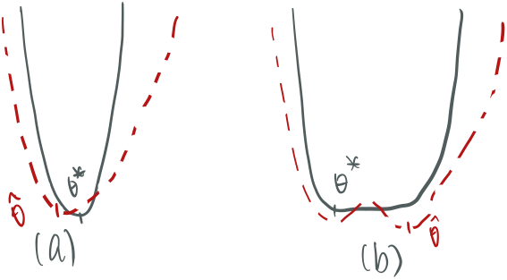

Let $E$ be the sample space and $\mathbb P_\theta$ be the statical model associated with a sample of i.i.d. r.v. $X_1,..,X_n$. Assume there exists $\theta^*$ s.t. it is the true parameter. Let $A\subset E$ be an interval of events. 

## Total Variation

The <u>total variation</u> distance between two probability measures, often between our predicted model $\mathbb P_{\hat\theta}$ and the true model $\mathbb P_{\theta^*}$ is 

$$
TV(\mathbb P_\theta,\mathbb P_{\theta'})=\max_{A\subset E}\vert\mathbb P_\theta(A)-\mathbb P_{\theta'}(A)\vert
$$

This is saying that the total variation between two probability is the event $A$ that can create the largest difference between these two distributions. For example, if $$TV(\mathbb P_{\hat\theta}, \mathbb P_{\theta^*})=0.1$$, this is saying $\mathbb P_{\hat\theta}(A)\in[\mathbb P_{\theta^*}(A)\pm 0.1]$, the estimated probability of $A$ will always be off from the true probability by 0.1. 

While it is hard to find *every* subset of the sample space $A\subset E$, there's an identity whose proof can be found online that can help us. If the sample space $E$ is discrete, then $X$ has a PMF s.t. $\mathbb P_\theta(X=x)=p_\theta(x)$, and 

$$
TV(\mathbb P_\theta,\mathbb P_{\theta'})=\frac{1}{2}\sum_{x\in E}\vert p_{\theta}(x)-p_{\theta'}(x)\vert
$$

If $E$ is continuous, we have a PDF $P(X\in A)=\displaystyle \int_A p_\theta(x)\:dx$, and 

$$
TV(\mathbb P_\theta,\mathbb P_{\theta'})=\frac{1}{2}\int_{ E}\vert p_{\theta}(x)-p_{\theta'}(x)\vert\: dx
$$

 

There're some properties:

- $TV(\mathbb P,\mathbb Q)=TV(\mathbb Q,\mathbb P)$ (Symmetric)
- $TV\geq 0$ (which can be proved by other properties)
- If $TV(\mathbb P_\theta,\mathbb P_{\theta'})=0$, then $\mathbb P_\theta = \mathbb P_{\theta'}$. 
- Triangular inequality

## From Total Variation to KL-divergence

Remember our goal is to spit out a $\hat\theta$ that makes our model $\mathbb P_{\hat\theta}$ is as close to the true model as possible. But we do know the $$\theta^*$$ so we cannot calculate the $$TV(\mathbb P_{\theta},\mathbb P_{\theta^*}),\: \forall\theta$$ nor minimize it. So the strategy is to estimate it, obtaining a $\widehat{TV}(\mathbb P_{\theta},\mathbb P_{\theta^*}),\: \forall\theta$. KL divergence is one way to estimate TV. Its formula is (for continuous variable):

$$
KL(\mathbb P,\mathbb Q)=\int_E p(x)\log(\frac{p(x)}{q(x)})\:dx
$$

It's a divergence but not a distance. First it's not symmetric. Although it's greater than 0 always, it doesn't satisfy the triangular inequality. 

A key property that's similar to a distance is that 

- If $KL(\mathbb P, \mathbb Q)=0$, then $\mathbb P=\mathbb Q$

Ok then how do we approximate this. Note that 

$$
\begin{align}
KL(\mathbb P,\mathbb Q)&=\mathbb E_p[\log\frac{p(x)}{q(x)}]\\
&=\mathbb E_p[\log p(x)]-\mathbb E_p[\log q(x)]
\end{align}
$$

Note KL-divergence is not symmetric so need to be careful of the ordering. In general, we use $\mathbb Q$ to estimate $\mathbb P$ and we put $\mathbb Q$ on the righthand side. When we are using $\mathbb P_\theta$ to estimate $\mathbb P_{\theta^*}$, we write $$KL(\mathbb P_{\theta^*},\mathbb P_\theta)$$, and that will become: 

$$
KL(\mathbb P_{\theta^*},\mathbb P_\theta)=\mathbb E_{p_{\theta^*
}}[\log p_{\theta^*}(x)]-\mathbb E_{p_{\theta^*}}[\log p_\theta(x)]
$$

Remember we're finding the $\theta$ that is closest to $$\theta^*$$, and we can view $$\theta^*$$ as an optimal constant. In the $KL(\mathbb P_{\theta^*},\mathbb P_\theta)$, the variable is $\theta$. We view the left half as constants and the right half is the things we minimize to minimize the KL divergence. That is:

$$
\begin{align}
\arg\min_{\theta}KL(\mathbb P_{\theta^*},\mathbb P_\theta)&=\arg\min_\theta (\mathbb E_{p_{\theta^*
}}[\log p_{\theta^*}(x)]-\mathbb E_{p_{\theta^*}}[\log p_\theta(x)])\\
&=\arg\min_\theta(-\mathbb E_{p_{\theta^*}}[\log p_\theta(x)])\\
&=\arg\min_\theta-\frac{1}{N}\sum_{i=1}^N\log p_\theta(X_i)\\
&=\arg\max_\theta\prod_{i=1}^Np_\theta(X_i)\\
&=\arg\max\ell(\theta;\mathcal D)
\end{align}
$$

which is the maximum likelihood estimation. From line 2 to 3 we're replacing the expectation with the estimation from the sample, from that on we're actually getting an estimated KL divergence. In the last line we're just renaming the product of probability into $\ell$. And emphasize it's a function of $\theta$. 

### Convexity

For a function to be strictly convex, it means that its $f''>0$ (parabola pointing upward) everywhere not at certain points.This implies that we only have one minima and that will be the absolute one. Similarly if a function is strictly concave, $f''<0$ everywhere and it has one maxima. The <u>KL divergence is guarantee to be convex</u> because $KL(\mathbb P, \mathbb Q)=0$ if and only if $\mathbb P=\mathbb Q$. And when we flip a convex function, it becomes a concave one. MLE is a concave function. 

For a function $h:\theta\subset\mathbb R^d\rightarrow\mathbb R$ (that would mostly be the likelihood function) that maps a set of parameters to a *real* number, we generalize the convexity into multivariate. It has

- Gradient vector: $$\nabla h(\theta)=\begin{bmatrix}\frac{\partial h}{\partial \theta_1}(\theta)\\ \vdots\\\frac{\partial h}{\partial \theta_d}(\theta) \end{bmatrix}$$
- Hessian matrix: $$\nabla^2h(\theta)=\begin{bmatrix}\frac{\partial h}{\partial \theta_1 \theta_1}(\theta) &…&\frac{\partial h}{\partial \theta_1 \theta_d}(\theta)  \\\vdots&\times&\vdots\\\frac{\partial h}{\partial \theta_d\theta_1}(\theta)&…&\frac{\partial h}{\partial \theta_d\theta_d}(\theta)  \end{bmatrix}$$

With these we can check the concavity of the function $h(·)$ by checking the matrix's definiteness. If the matrix $\nabla^2h(\theta)$ is negative definite, this means the function $h(\theta)$ is strictly concave. To test its negative definiteness, we see if $\mathbf x^\top \nabla^2h(\theta)\mathbf x<0,\forall\mathbf x\in\mathbb R^d\backslash \{0\}$ .

## Fisher Information

Intuitively, the Fisher information measures how easy a parameter $\theta$ in a model $\mathbb P_\theta$ can be approximated (this is determined by which parameter of a distribution is, like $\mu$ or $\sigma$ in Gaussian, and the value of the parameter). In figure 1, both graphs are KL-divergence graphs (or negative likelihood) w.r.t. a parameter $\theta$. In (a), we see a sharp curve will lead a sharp estimate, this leads the estimated parameter $\hat\theta$ regardless of sample closer to the true one. In (b), when the graph is flatter, it's harder to get a good estimate to the KL-divergence and thus $\hat\theta$ will likely to far off. 

 <figure>
  <figcaption style="text-align: center; font-family: MJXc-TeX-math-I,MJXc-TeX-math-Ix,MJXc-TeX-math-Iw; font-size: 1.1rem;">Figure 1. 'sharp' curve vs 'flat' curve </figcaption>
</figure>

Fisher information is used to measure this. It is the variance of a "score", the expectation of log likelihood of the data given the model is "true", that is:

$$
\begin{align}
\mathbb E_{X\sim f(X;\theta^*)}\left[\left.\frac{\partial}{\partial \theta}\log f(X;\theta)\right\vert\theta=\theta^*\right]&=\int f(X;\theta^*)\frac{1}{\log f(X;\theta^*)}\frac{\partial f(X;\theta^*)}{\partial \theta^*}\:dx\\
&=\frac{\partial}{\partial \theta^*}\int f(X;\theta^*)\:dx\\
&=\frac{\partial}{\partial\theta^*}1=0
\end{align}
$$

We know the expectation of the score, the variance of a single variable case is just:

$$
\mathcal I(\theta)=\mathbb E_{X\sim f(X;\theta^*)}\left[\left(\left.\frac{\partial}{\partial \theta}\log f(X;\theta)\right)^2\right\vert\theta=\theta^*\right]
$$

When the log likelihood is twice differentiable:

$$
\begin{aligned}
\frac{\partial ^{2}}{\partial \theta ^{2}}\log f(X;\theta ) & =\frac{\partial }{\partial \theta }\left(\frac{1}{f(X;\theta )} f'\right)\\
 & =\frac{\partial }{\partial \theta }\left( -\frac{f'}{( f (X;\theta ))^{2}} f'+\frac{1}{f(X;\theta )} f''\right)\\
 & =\frac{\partial }{\partial \theta }\left(\frac{1}{f(X;\theta )} f''-\left[\frac{f'}{f (X;\theta )}\right]^{2}\right)\\
 & =\frac{\partial }{\partial \theta }\left(\frac{1}{f(X;\theta )} f''-\left[\frac{\partial }{\partial \theta }\log f( X;\theta )\right]^{2}\right)
\end{aligned}
$$

And the expectation of the left term is zero because the $f$ in the denominator is canceled out. And therefore

$$
\mathcal I(\theta)=-\mathbb E\left[\left.\frac{\partial ^{2}}{\partial \theta ^{2}}\log f(X;\theta ) \right\vert\theta=\theta^*\right]
$$

So Fisher information can be seen as measuring the curvature of the KL divergence. When the curvature is higher, we're more easily to approximate the parameter. 

For instance, the Fisher information for Bernoulli is 

$$
\mathcal I(\theta)=\frac{1}{\theta(1-\theta)}
$$

In multivariate case, the Fisher Information matrix is just:

$$
\mathcal I(\theta)=\mathbb E[\nabla \log f \nabla\log f^\top]=-\mathbb E[\nabla^2\log f]
$$

the Hessian matrix of log likelihood. An extra tip (with certain assumptions and by central limit theorem) is that $\mathcal I(\theta)$ represents the inverse of variance. When curvature is higher, the variance is smaller (which is a good thing).  

