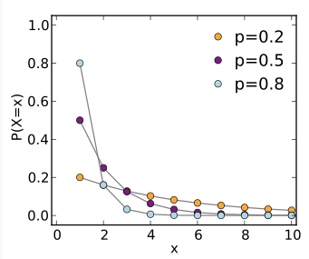
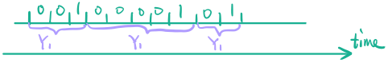

<u>A Bernoulli process is a sequence of independent Bernoulli trials</u> $X_1, X_2…$, which is nothing but coin flips. 

For <u>an independent trial</u> $X_i$, we know, at each trial:

- P(success) = $P(X_i=1)=p$ 
- P(failure) = $P(X_i=0)=1-p$

The success rate $p$ does not vary with time. It will remain constant throughout the trials. <u>This property is essential throughout the discussion of the process</u>. Often time we use the term <u>arrival</u> as success. We also know:

- $\mathbb E[X_i]=p\cdot 1+(1-p)\cdot 0=p$
- $\mathbb V[X_i]=p(1-p)$

In general, we are more interested in <u>a collection of trials</u>. That's what makes it a *process*. Important questions of a process are:

- Within $n$ time slots (we have discrete time for Bernoulli Process), what's the # of expected arrivals $\mathbb E[N_n]$?
- Expected # of trials (time) to have the first arrival $\mathbb E[Y_1]$ 
- Expected # of trials (time) to have the kth arrival $\mathbb E[Y_k]$  

(All success quesiton)

## Expected number of arrivals within n time slots

This is a very familiar random variable. The random variable $N_n$ is in fact a sum of all trials $X_1,..X_n$ within the time slots, and thus is a binomial variable. So within $n$ time slots, (note always $n>k$)

- $P(N_n=k)=\begin{pmatrix}
   n\\\
   k
  \end{pmatrix}p^k(1-p)^k$ <u></u>
- $\mathbb E[N_n]=\mathbb E[X_1+…+X_n]=np$ <u></u>
- $\mathbb V(N_n)=Var(X_1+...+X_n)=nVar(X_1)=np(1-p)$ <u></u>

## Expected number of trials to reach the first arrival (interarrival)

Similar to above, to find the expectation, we'd probably need to know the probability first. Since if we do not get the success, we keep trying, it follows that the random variable $Y_1$ is just geometric with parameter $p$ (as determined by the independent Bernoulli trials). 

- $P(Y_1=t)=(1-p)^{t-1}p$ 
- $\displaystyle \mathbb E[Y_1]=\frac{1}{p}$ (Proof tips: because of derivative of infinite sum of geometric sequence)
- $\displaystyle\mathbb V(Y_1)=\frac{1-p}{p^2}$ 

An obvious implication is that the higher probability we can receive success, that is, higher $p$, is, there's higher probability that we get success on the 1st trial. 

See the following picture of geometric pmf:

 <figure>
  <figcaption style="text-align: center; font-family: MJXc-TeX-math-I,MJXc-TeX-math-Ix,MJXc-TeX-math-Iw; font-size: 1.1rem;">Figure 1. Geometric pmf </figcaption>
</figure>

This is also the <u>interarrival</u> time as an immediate consequence of independence between trial. Each time we have one success is not going to affect how the next success arrives. This is called the <u>memoryless</u> property. So the interarrival time will not change and same as the first arrival time. 

 <figure>
  <figcaption style="text-align: center; font-family: MJXc-TeX-math-I,MJXc-TeX-math-Ix,MJXc-TeX-math-Iw; font-size: 1.1rem;">Figure 2. Interarrival </figcaption>
</figure>

### Practical example: Coupon Collections

Q: There're 6 distinct types of coupons equally distributed in a box. Each draw is independent of prior selections, what's the expected number of draws (with displacement) to collect all 6 types of coupon?

Let $Y_i:=$ the number of draws needed to collect ith distinct coupons. In this case, $E[Y_6]$ is the solution we're looking for. As usual, it's often not helpful to directly fix the eyes on the original random variable "described" by the problem, we need to somehow decompose it. 

Let $X_i:=$ the number of *additional* draws to collect ith distinct coupons. Then, $X_i=Y_{i+1}-Y_i$, by the definition of "additional" or new draws. Taking a careful consideration, $X_i$ is geometrically distributed with $(6-i)/6$  probability. Why? With displacement, each draw has $(6-i)/6$ probability to get a new coupon. Each draw is $Bernoulli(\frac{6-i}{6})$. Thus the expected arriving time for next trial is $Geo(\frac{6-i}{6})$. 

Ok then. Knowing $X_i$, what's $Y_6$? 

$$
Y_6=\sum_{i=0}^5X_i=-Y_0+Y_1-Y_1+...Y_6
$$

(Because $Y_0=0$, we need 0 draws to collect 0 coupon) Then 

$$
E[Y_6]=\sum_{i=0}^5E[X_i]=\sum_{i=0}^5\frac{6}{6-i}=6*(1+\frac{1}{2}+...+\frac{1}{6})=14.7
$$

Therefore, in general case when there're K types of coupon, the solution is

$$
E[Y_K]=\sum_{i=0}^{K-1}\frac{K}{K-i}=K*\sum_{i=1}^{K}\frac{1}{i}
$$

Now let's ask from the other perspective,

Q: If the child has collected 10 coupons, what's the expected number of distinct types? 

Still, let $Y:=$ the number of distinct types in these 10 coupons. And let 

$$
Y_k=\cases{\begin{align}
&1,if\ k-th \ type\ is\ in\ the\ 10\ coupons\\
&0, otherwise
\end{align}}
$$

Clearly $Y=\sum_{k=1}^6Y_k$. Since we assume replacement, each draw, there's $1/6$ probability to draw the k-th type, either it's 1,2,3,4,5,6. And there's $5/6$ chance that we do not draw the type k. But note that $Y_k$ is for 10 trials (we have collected 10 coupons, so we must draw 10 times), there's $(5/6)^{10}$ chance that we do not draw type k in 10 trials. And thus $Y_k=1-(5/6)^{10}$ (it's easier to think that each type has $p_k$ probability to be included, and $p_k=1/6$)

$$
E[Y]=\sum_{k=1}^6E[Y_k]=\sum_{k=1}^6(1-(5/6)^{10})=6-6*(\frac{5}{6})^{10}
$$

(This sounds a lot like an inverse “Expected number of trials to reach the kth arriva” problem where instead $t$ is known but $k$ isn't @todo)

## Expected number of trials to reach the kth arrival

The probability of having k arrivals at the $t$th trial is $P(Y_k=t)$. This is equivalent to saying having $k-1$ arrivals with $t-1$ trials and then have another arrival at the $t$th trial. (This is a nice trick to get the probability otherwise we will need to do convolution)

- $P(Y_k=t;k)=\begin{pmatrix}
   t-1\\\
   k-1
  \end{pmatrix}p^{k-1}(1-p)^{t-k}p$ 

From another perspective, note that $Y_1$ is the interarrival times. This means that the time took have kth arrival is equal the k * the time needed for the interarrival time. 

- $\mathbb E[Y_k]=k\mathbb E[Y_1]=\displaystyle \frac{k}{p}$ (This is saying having k arrivals is expected to take $k/p$ trials
- $\mathbb V(Y_k)=\displaystyle k\frac{1-p}{p^2} $ 

Similar trick can be applied to variance because each of the random variables are independent. 

## Merging and Splitting of Bernoulli Process

Let's talk about merging for now. In general, the question to ask about merging Bernoulli process is, what's the probability that either one process(event) happens? Say we have two Bernoulli process A and B, the key is to find out either one happen. That's obvious, given that each event is a Bernoulli random variable with $p$ and $q$ probability, either one happens it's just $p+q-pq$. 

(But in Poisson Process, maybe due to taking the limit, $pq$ disappear)