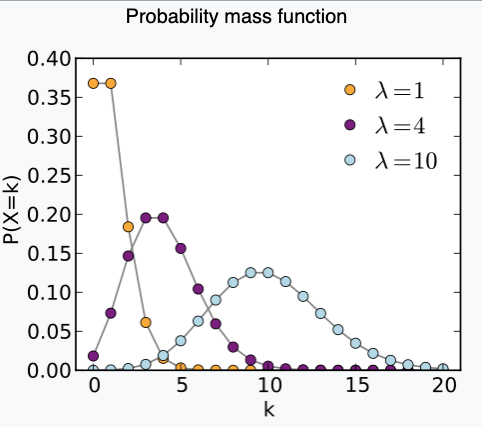
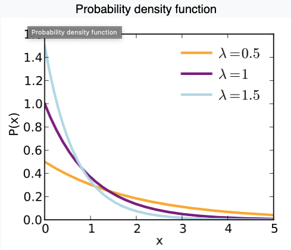
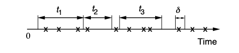

Similar to Bernoulli process, <u>a poisson process is a sequence of independent Poisson trials</u> $$X_1,X_2…$$,<u>all of which are Poisson random variables.</u> Poisson variable is from a binomial random variable $$Bin(n,p)$$ s.t. $$n\rightarrow \infty,p\rightarrow0$$. It's like stretching in both ends. 

Therefore, for <u>an independent trial</u> $$X_i$$, at each trial, let $$\lambda=np$$,:

- $$P(X_i=k;\lambda)=\lim_{n\rightarrow\infty}\begin{pmatrix}n\\k\end{pmatrix}\displaystyle \left(\frac{\lambda}{n}\right)^k\left(1-\frac{\lambda}{n}\right)^{n-k}=e^{-\lambda}\frac{\lambda^k}{k!}$$ <u></u>

- $$\mathbb E[X_i]=\lambda$$ <u></u>
- $$\mathbb V(X_i)=\lambda$$ <u></u>

where $$\lambda$$ <u>is the arrival rate, measuring how frequent, in a very short period of time, how many arrivals should there be</u>. Given these, let's try to answer the same important questions for Bernoulli trials last time. 

 <figure>
  <figcaption style="text-align: center; font-family: MJXc-TeX-math-I,MJXc-TeX-math-Ix,MJXc-TeX-math-Iw; font-size: 1.1rem;">Figure 1. Poisson pmf </figcaption>
</figure>

## Number of Expected arrivals within time n

Since it's Poisson process also consists of independent trials, the memoryless property comes in. Also I don't quite remember how the pmf is same as independent trial. 

- $$P(N_n=k)=\displaystyle e^{-\lambda}\frac{\lambda^k}{k!}$$ <u></u>

- $$\mathbb E[N_n]=\lambda n$$ <u></u>
- $$\mathbb V(N_n)=\lambda n$$ <u></u>

## Expected number of trials to reach the first arrival (interarrival)

Exponential (special case of erlang). <u>Note that these distribution are all governed by the independent Poisson trial's arrival rate parameter</u> $$\lambda$$. 

- $$P(Y_1=y)=\lambda e^{-\lambda y}$$ <u></u>
- $$\mathbb E[Y_1]=\displaystyle\frac{1}{\lambda}$$ <u></u>
- $$\mathbb V(Y_1)=\displaystyle \frac{1}{\lambda^2}$$ <u></u>

 <figure>
  <figcaption style="text-align: center; font-family: MJXc-TeX-math-I,MJXc-TeX-math-Ix,MJXc-TeX-math-Iw; font-size: 1.1rem;">Figure 2. Exponential pdf </figcaption>
</figure>

## Expected number of trials to reach the kth arrival

Erlang, which is also a special case of Gamma distribution 

- $$P(Y_1=y;k)=\displaystyle \frac{\lambda^ky^{k-1}e^{-\lambda y}}{(k-1)!}$$ <u></u>

We have continuous time:

 <figure>
  <figcaption style="text-align: center; font-family: MJXc-TeX-math-I,MJXc-TeX-math-Ix,MJXc-TeX-math-Iw; font-size: 1.1rem;">Figure 1. Continuous Time </figcaption>
</figure>

